# ChronoAtlas 证据资料池与事件模型设计 v1

> 状态：第二轮设计评审稿，尚未批准物理落库。
> 冻结要求：本文档确认前，不新增证据／事件相关迁移，不批量晋级正史候选事件，不改写既有原文。
> 目标：以后增加新朝代、新国家、新文献类型、考古材料、地图证据或不同事件划分法时，扩充数据和词表，而不是反复改造核心关系。

## 1. 总结性决定

ChronoAtlas 建设的不是“古籍句子卡片库”，而是一条可以重复核查、跨文献比较、重新划分事件并复现旧版本的证据链：

```text
来源身份与具体见证
  → 原始载体与不可变文本修订
  → 可精确定位的证据锚点
  → 机器提出的来源陈述候选
  → 人工确认的来源陈述／非文本观察
  → 跨来源规范化历史命题
  → 有责任人和研究语境的证据评估
  → 有版本的专题资料集
  → 人工事件资格决定
  → 有版本的事件划分方案与事件边界假说
  → 有版本的页面发布
```

最重要的长期原则是：

> 原文不等于来源陈述，来源陈述不等于项目规范命题，规范命题不等于事件，事件边界不等于页面卡片。

同一件事在《武帝纪》《先主传》《吴主传》《周瑜传》中出现四次，应该形成四组可追溯的来源陈述，经过人工判断后共同连接一个或多个规范命题；它们不会自动生成四个赤壁事件。

## 2. 不再轻易改变的核心不变量

1. **证据先于事件**：自动程序只能产生来源陈述候选和非持久化分组建议，不能直接写入事件边界假说或正式事件。
2. **人工资格闸门**：没有人工 `eligible_for_hypothesis` 决定，事件假说数量必须为零。
3. **原文只有一条权威保存链**：事件、命题、搜索索引和页面不得各保存一份“原文真值”。
4. **不可静默覆盖**：文本、来源陈述、命题、专题资料集、划分方案、事件假说和发布内容都采用“稳定系列 ID + 不可变修订”。
5. **精确发布快照**：每个发布修订固定引用特定文本、陈述、命题、资料集、方案和事件假说修订，后台后续编辑不得改变旧页面所依据的证据。
6. **同一命题允许多来源**：新增史料只增加来源陈述和证据评估，不按文献篇数复制事实或事件。
7. **异说永不因当前采用意见而删除**：采用一种解释只改变当前发布选择；反对、补充、替代和未决意见继续保留。
8. **不同事件拆法可并存**：同一批命题可以形成狭义、中义和广义方案；每个页面发布修订只能明确采用其中一个方案。
9. **工作流与认识判断分离**：材料被正确抽取但内容未必可信；“抽取有效”和“历史命题成立”是两个不同问题。
10. **未知就是未知**：时间、地点、人物和因果不详时保留范围、候选或空值，不插值、不推测移动路线。
11. **稳定 ID 不依赖标题和年代**：改名、改年、合并、拆分或换方案时保留身份和修订谱系。
12. **外部类型通过明确身份与关系接入**：碑铭、简牍、钱币、遗址、舆图和 GIS 分别建立作品、对象、数据集等独立身份，再以 bears／embodies／derived_from 连接，并增加专用见证／锚点子类型；不改变“锚点—陈述／观察—命题—事件”主干。
13. **受限内容不得泄漏**：权利受限全文不能进入 Git Seed、前端 JSON、公开搜索正文、向量语料或模型日志。
14. **公开页面可离线复现**：从已提交 Seed 和清单重建前端不依赖再次联网抓取，不重新生成稳定 ID。

## 3. 总体逻辑模型

```mermaid
flowchart LR
    SR["来源实体 Source Entity"] --> ROLES["互斥身份子类型 Work / Object / Dataset"]
    ROLES --> WI["具体见证 Witness"]
    WI --> AS["数字或物理载体 Asset"]
    WI --> TE["文本表达 Text Expression"]
    TE --> TR["不可变文本修订 Text Revision"]
    TR --> TU["该修订的结构单元"]
    TU --> AN["证据锚点 Evidence Anchor"]
    AS --> AN

    AN --> AP["来源陈述候选 Assertion Proposal"]
    AP --> SA["来源陈述 Source Assertion"]
    AN --> OB["非文本观察 Observation"]
    SA --> CM["来源陈述—命题归一映射"]
    CM --> CL["规范命题 Canonical Claim"]
    SA --> EA["证据评估 Evidence Assessment"]
    OB --> EA
    EA --> CL

    CL --> DR["专题资料集修订 Dossier Revision"]
    DR --> SC["事件划分方案修订"]
    SC --> CS["人工候选命题集修订"]
    CL --> CS
    CS --> ED["人工事件资格决定"]
    ED --> EH["事件边界假说修订"]
    SC --> EH
    CL --> EH
    EH --> PR["页面发布修订"]
    PR --> UI["事件卡 / 人物页 / 时间轴 / 地图"]
```



横向关系分成三个互不混用的域：

1. 文献传承、转引、版本、翻译与文本对齐关系；
2. 历史命题、来源依赖与证据评估关系；
3. 事件的历史关系、跨方案假说比较关系、数据修订谱系关系。

## 4. 通用身份与修订契约

### 4.1 稳定系列与不可变修订

会被编辑的对象都分为两层：

- **系列 ID**：表示长期身份和稳定链接；
- **修订 ID**：表示某一时刻不可变的具体内容。

至少适用于：

- 文本表达；
- 来源陈述；
- 规范命题；
- 专题资料集；
- 事件划分方案；
- 事件边界假说；
- 页面发布。

新修订以 `supersedes_revision_id` 指向前一修订。旧修订不得修改或删除；错误内容通过新修订、撤回或作废决定处理。

### 4.2 ID 规则

- 人工确认的长期对象使用带类型前缀的 UUIDv7，创建后写入 Seed，重建时不得重新生成。
- 机器候选使用内容寻址指纹：输入修订 ID、锚点 ID、完整运行配置指纹和规范候选内容共同计算；相同输入不保证非确定性模型再次输出相同内容，但相同输入、配置和候选内容必须复用同一 ID。
- 内容 SHA-256 用于一致性和查重，不作为长期业务身份。
- 标题、年份、人物名和 slug 不作为主键。
- 合并、拆分、替代都保留显式谱系，不复用被替代对象的 ID。

### 4.3 通用治理引用

治理日志需要引用不同对象，但业务关系不得继续使用任意 `subject_table + subject_id`。

推荐约束：

- 所有可审核系列在统一 `curated_records` 注册稳定 ID 和对象类型；所有不可变修订在 `curated_record_revisions` 注册修订 ID、所属系列和内容哈希；
- 各领域表以同一 ID 作为共享主键子类型；
- `review_decisions` 必须引用具体 `curated_record_revision_id`；`change_log`、`legacy_id_map` 可按用途引用系列或修订注册表；
- 命题—人物、命题—地点、事件—命题等业务关系仍使用真实外键关系表。

这样既能统一审核和历史记录，又不牺牲领域完整性。

## 5. 来源实体、具体见证与载体

### 5.1 `Source Entity` 是共享主键超类型，每个 ID 只属于一种身份子类型

每个 Source Entity 必须且只能选择一种身份标准：

- `Work`：具有独立智识内容和责任者的作品；
- `Object`：钱币、简牍、碑刻、墓葬、器物、遗址等实物或考古对象；
- `Dataset`：目录、地名库、表格、舆图数字化成果、GIS 数据集。

同一现实材料可能涉及多种身份，但必须建立不同 Source Entity，再用显式关系连接。例如：

- 碑本体是 Object；碑文内容是 Work；两者以 `bears` 连接。
- 历史地图内容是 Work；某次数字化 GIS 成果是 Dataset；两者以 `derived_from` 连接。
- 简牍实物是 Object；其书写文书是 Work；具体书写面或整理版本由 Witness 表达。

不能让同一 ID 同时代表抽象作品和具体物体，否则责任者、版本、权利、存佚和证据定位都会失去明确含义。

“接受史”不是来源本体类型，而是材料在某个研究问题中的用途。小说不能直接支持“208 年发生了什么”的军事史命题，但可作为“后世如何叙述赤壁”的接受史一手材料。

### 5.2 `Work`：抽象作品

示例：

- 陈寿《三国志》；
- 裴松之《三国志注》；
- 虞溥《江表传》；
- 司马光《资治通鉴》；
- 一篇现代论文；
- 一篇网络分析文章。

规则：

- 陈寿正文与裴松之注是两个作品，以 `annotates` 连接。
- 裴注引用《江表传》时，《江表传》有独立作品身份，以 `quotes`／`preserves_fragment_of` 连接。
- 亡佚书标明 `lost` 或 `fragmentary`，并记录传存宿主，不伪装成现存完整版本。
- 作者、编者、注者、译者、校勘者、辑佚者等使用“责任者 + 角色 + 有效范围”关系，不塞进单一 `author` 字段。

作品属性采用多轴词表：

- 体裁；
- 成书时代及与事件的时间距离；
- 传承方式；
- 叙事传统／立场；
- 语言；
- 存佚状态。

这些属性用于解释来源背景。不得用一个“全书可信度分数”替代对作品、传本、版本、录文和具体命题的分层评估。

### 5.3 `Witness`：作品或对象的具体见证

`Witness` 统一表示可被取得、描述和引用的具体呈现：

- 现代点校本或影印本；
- 某一手稿、抄本、碑面、简牍书写面；
- 钱币正面／背面；
- 数据集某次发布；
- 网页某次快照；
- 一份现代译本的具体出版版本。

关系可以是：

```text
Work ── embodied_in ──> Witness
Object ── bears / represented_by ──> Witness
Dataset ── released_as ──> Witness
Witness ── represented_by ──> Asset
Witness ── transcribed_as ──> Text Expression
```

一部合刊可以包含多个作品，一个作品也可以有多个版本／见证，因此 Work 与 Witness 是多对多。

### 5.4 `Asset`：实际取得的文件或媒介

PDF、扫描页、图片、HTML 快照、TXT、TEI、数据库导出、音视频和本地数据文件都属于 Asset。至少保存：

- 所属 Witness；
- 文件类型、位置、MIME；
- SHA-256；
- 获取时间、来源 URL；
- OCR／转换工具及参数；
- 完整权利记录和访问级别。

数据库不一定存大文件本身，但必须有可验证清单和哈希。网页哈希只证明内容版本，不能自动产生保存或公开全文的权利。

## 6. 文本表达、不可变修订和结构单元

### 6.1 表达类型与修订版本必须分开

`Text Expression` 表示文本的处理／表达路径：

- `diplomatic_transcription`：忠实录文；
- `punctuated`：点校／标点文本；
- `normalized_search`：检索规范化文本；
- `display_conversion`：简繁或异体字显示转换；
- `translation`：项目内部译文。

`Text Revision` 表示某一 Expression 的不可变修订历史。例如 OCR 初稿和 OCR 修正稿是同一表达的不同修订；忠实录文和现代译文不是同一修订链。

正式出版译本按独立 Work + Witness 编目。项目内部译文可以作为派生 Text Expression，并与原文锚点建立对齐。

### 6.2 结构单元属于具体文本修订

每个 Text Revision 拥有自己的不可变结构树：

```text
书／合刊
└─ 卷
   └─ 纪／传／章
      └─ 纪年条／条目／自然段
         ├─ 正文
         ├─ 注文
         └─ 注文所引他书
```

不同点校本和译文的段落边界可能不同，所以不得默认共享同一结构单元 ID。跨表达、跨修订、跨版本的对应通过 `text_unit_alignments` 与 `text_anchor_alignments` 显式记录。

每个**有正文内容的叶级结构单元**必须归属且只归属一个 Work；合刊容器可以没有单一 Work，但必须在作品边界处分出子单元。陈寿正文、裴松之注文和裴注所引他书因此不会仅凭同一 Witness 混在一起。Text Anchor 继承其结构单元的 Work 归属，Source Assertion 再记录具体叙述声音。

固定 1800 字或 token 分块只允许作为搜索索引的派生数据，不得成为永久学术引用锚点。

### 6.3 文本存储与锚点坐标契约

为了让 JavaScript、Python 和 SQLite 得到完全相同的定位，v1 冻结以下规则：

1. Text Revision 的内容以 UTF-8、无 BOM、LF 换行持久化。
2. `content_sha256` 对上述精确 UTF-8 字节计算；锚定时不再次做 Unicode 规范化。
3. 每个表达在创建时记录其 Unicode 规范化策略；忠实录文允许 `none` 或明确指定策略，检索规范化属于另一 Expression。
4. 文本位置相对于**当前 Text Revision 中该结构单元的正文内容**，使用零基 Unicode code point 索引，区间采用半开形式 `[start, end)`；禁止使用整本累计位置、UTF-8 字节或 JavaScript UTF-16 code unit 作为持久坐标。
5. Text Anchor 同时保存：
   - 位置选择器：Text Revision、结构单元、start、end；
   - 引文选择器：精确引文、前文和后文；
   - 引文及上下文哈希；
   - 人类可读的卷、页、栏、行定位。
6. 每次读取都验证内容哈希、区间和引文。失败时旧锚点标记 `invalidated`，通过新锚点和 `realigned_from` 建立迁移；禁止静默移动旧 offset。

证据边界以“足以判断陈述及其语境”为原则，不假定古籍天然存在现代标点意义上的句子。

## 7. 证据锚点、来源陈述与非文本观察

### 7.1 Evidence Anchor 是共享主键超类型

永久锚点子类型至少预留：

- `Text Anchor`：精确文本区间；
- `Image Region Anchor`：图像版本、页／图、坐标系和区域；
- `Object Feature Anchor`：只定位对象、表面、区域、铭文行或出土层位；
- `Dataset Feature Anchor`：数据集发布版本、表／图层、feature key、查询条件和记录哈希。

非文本材料不能从“看到一枚钱币”直接跳到宏观历史结论。Anchor 只负责定位；`Observation Series/Revision` 另行保存铭文读法、直径、材质、出土层位、方法、单位、误差、观察者和时间。Observation 采用稳定系列与不可变修订，再由 Evidence Assessment 说明它如何支持历史命题，避免两份观察真值。

### 7.2 机器输出是 `Assertion Proposal`，不是 Claim 或 Event

机器候选保存：

- 输入 Text Revision 和 Anchor；
- 抽取器／模型／提示词／规则版本；
- 原始输出及规范化候选；
- 确定性 proposal ID；
- 运行批次和 reconciliation 状态。

人工裁决只能是：

- `attach_existing_assertion`；
- `create_assertion`；
- `split`；
- `merge`；
- `reject_extraction`；
- `needs_more_context`。

候选不是长期历史事实。它可以被替代但不硬删除。

### 7.3 `Source Assertion` 只回答“该来源声音说了什么”

来源陈述必须保存：

- 精确 Evidence Anchor；
- 叙述声音：作者、编者、注文作者、引述人物、匿名传闻等；
- 明言／暗示；
- 肯定、否定、推测、传闻、命令、愿望等模态；
- 适用范围和上下文；
- 稳定系列与不可变修订。

“裴注引某人说 X”“裴松之本人赞同 X”“ChronoAtlas 编辑采用 X”必须是三种不同数据，不得压成同一关系。

非文本材料的对应层是 `Observation Series/Revision`：记录观察本身，而不是假装物体会“陈述”。

## 8. 规范命题与证据评估

### 8.1 `Canonical Claim` 是语言无关、可独立评估的命题

规范命题不是中文句子本身。系列保存命题身份，修订保存结构化范围和谓词角色，本地化表保存中文、英文等可读表述。

命题可以描述：

- 一次发生或行动；
- 一段持续状态；
- 人物关系或任职；
- 地点、数量或属性；
- 原因、影响或学者解释；
- 接受史中的叙述和观念。

最小粒度规则：

> 如果两部分可能一真一假、需要不同证据、时间地点不同或模态不同，就应拆成两个命题；否则不要为了句法而机械拆分。

例如“火攻发生并促成曹军退却”必须拆成：

- 火攻发生；
- 火攻促成曹军退却。

第二项是因果命题，证据强度可能与第一项不同。

### 8.2 来源陈述怎样归一到命题

每条 Source Assertion 可以：

- 归一到一个现有 Claim Revision；
- 同时涉及多个 Claim Revision；
- 因范围不同形成新 Claim；
- 暂不归一；
- 被判为抽取错误。

这一归一使用独立、不可变的 `Source Assertion → Canonical Claim Mapping`，固定引用 Assertion Revision 与 Claim Revision，并区分：

- `expresses`：基本完整表达该命题；
- `partially_expresses`：只表达其中一部分；
- `presupposes`：以该命题为前提；
- `unresolved`：尚不能可靠归一。

归一映射只回答“来源声音表达了哪个规范命题”，不能兼任项目对证据强弱的评价。后者只进入 Evidence Assessment。

多部史料表达同一命题时，保留各自 Assertion，不先删除或合并来源声音。

如果史料明确否定 X，应建立带否定模态的命题 not-X，并以 Claim Relation 与 X 建立冲突。不能只在某条引文上写一个模糊 `contradicts`。

Claim 的合并、拆分和替代使用专门 lineage，不依赖通用日志；所有下游 Dossier、Hypothesis 和 Publication 保留旧修订指向，并可显式迁移到新修订。

### 8.3 `Evidence Assessment` 是有语境的编辑／研究判断

Evidence Assessment 记录某位评审者在某个 Corpus/Dossier Revision 下，认为一条 Source Assertion 或 Observation 如何作用于某个 Claim Revision：

- `supports`；
- `undermines`；
- `qualifies`；
- `contextualizes`；
- `insufficient`；
- `not_applicable`。

它保存责任人、理由、采用的方法、来源依赖组和不可变修订。`supported / mixed / contested` 是由评估记录计算或发布时选定的结果，不是 Claim 永久固有属性。

“材料确实这样记载，但该说法不可信”应表现为：

- Source Assertion 审核有效；
- Claim 的认识评估为 contested／unsupported；
- 不能把它误作 `reject_extraction`。

### 8.4 来源依赖与沉默证据

- 转引、抄袭、共同底本和后出改写必须通过 Source Relation 或 Evidence Dependency 记录。
- “四部书都说”不能自动等于四份独立证据；支持数量按独立传承组和具体评估解释。
- 某书未提到某事，默认不是反证。只有在明确覆盖范围、预期应记而未记、且由评审者说明方法时，才能形成“沉默证据”评估。

## 9. Corpus 与专题 Dossier

### 9.1 Corpus 是有版本的收录计划

例如“汉末三国核心史料库 v1”。每个 Corpus Revision 明确：

- 计划覆盖哪些作品、Witness、卷章和材料类别；
- 纳入／排除理由；
- 是否已取得、录文、切分、校验、标注和互校；
- 权利与缺失范围；
- 发布日期和变更说明。

“全面”由覆盖矩阵证明，而不是由书目数量证明。矩阵至少覆盖：

- 政权／叙事传统；
- 与事件的时代距离；
- 文献体裁；
- 传世、出土与物质材料；
- 政治、军事、制度、社会、地理等主题；
- 各处理和审核阶段。

可由成员和处理记录计算的覆盖率做派生视图，避免双写一个容易过期的数字。

### 9.2 Dossier 是内部研究工作区，不是事件

“赤壁相关资料 dossier”可先收资料，再形成命题。Dossier Revision 必须能通过有真实外键的成员表收录：

- Source Entity／Witness／Text Unit 范围；
- Evidence Anchor；
- Assertion Proposal；
- Source Assertion／Observation；
- Canonical Claim Revision；
- 研究笔记和书目线索；
- Scheme 的明确出处。

Dossier 成员角色只描述相关性，例如：

- 待评估材料；
- 年代线索；
- 地望线索；
- 叙事／观点材料；
- 文献批评；
- 接受史；
- 排除线索。

“核心、前提、阶段、后果”已经是事件边界判断，只能出现在具体 Event Hypothesis 中，不能作为 Dossier 固有属性。

每个 Dossier Revision 记录研究问题、纳入／排除规则、所据 Corpus Revision 和缺口。方案必须引用一个不可变 Dossier Revision，不能跟随工作区后来增删而静默改变。

### 9.3 进入划分阶段的覆盖门

资料不必绝对穷尽，但开始正式事件划分前必须记录：

- 已计划的核心材料；
- 已取得／未取得材料；
- 已验证的关键原文；
- 尚未解决的文本、年代、地点和来源依赖问题；
- 未决争议是否阻止发布，或只需要显式披露。

### 9.4 人工候选命题集

单个 Claim 往往不足以定义一个事件边界。覆盖门通过后，可以先登记 Scheme Revision，再由人工建立 `Event Candidate Claim Set Series/Revision`：

- 每个 Set Revision 固定一组精确 Claim Revision ID、成员顺序和集合哈希；
- 一项命题也必须包装成单成员 Set，Eligibility 不直接引用游离 Claim；
- 机器可以提出临时分组建议，但无权创建已确认 Set Revision；
- 修改成员产生新 Set Revision，旧资格决定继续指向旧快照；
- Set 只表示“送交资格判断的一组命题”，不等于 Event Hypothesis。

## 10. 从命题到事件的强制资格闸门

### 10.1 机器没有 Event Hypothesis 写权限

抽取器可以输出“这些命题可能相关”的临时建议，但不能插入持久 `event_hypotheses`。

只有人工 Event Eligibility Decision 为 `eligible_for_hypothesis` 时，才能创建事件边界假说。决定必须固定引用一个 Event Candidate Claim Set Revision，并且限定：

- Dossier Revision；
- 可选的 Scheme Revision；
- 使用场景／发布层级；
- 所据 Event Policy Revision；
- 比较过的现有 Event Publication／Hypothesis；
- 审核者、理由、时间；
- 被替代的前一决定。

每个 Event Hypothesis Revision 必须通过真实外键引用一项当前有效的 `eligible_for_hypothesis` Decision Revision；数据库可直接验证“无资格决定则无 Hypothesis”。

### 10.2 资格决定必须长期保留

处置值：

- `not_event`：不是历史事件对象；
- `context_only`：可作背景、人物施政或纪年说明；
- `duplicate_of`：与已有事件边界同事异述；
- `defer_insufficient`：材料或边界不足；
- `eligible_for_hypothesis`：可进入人工事件划分。

`not_event` 和 `context_only` 是有价值的正面审核成果，不是丢弃状态。相同修订和同一 Dossier／Policy 下重跑必须继承它们，不能反复进入边界队列。

### 10.3 事件本体资格与页面发布质量分开

事件本体资格只要求：

1. 它描述可辨识的发生、行动、决策、冲突、过程或状态变化，而非单纯评价、固定套语或长期状态本身；
2. 一组命题边界具有内部连贯性；
3. 有可回溯的已审来源陈述／观察；
4. 已检查是否与现有事件同事异述。

时间、地点或参与者不详不必否定事件存在；匿名集体行动和长期过程也可能是事件。

页面发布另有质量门：

- 解释边界、时间、地点、参与者和不确定性；
- 说明独立展示价值；
- 说明与父级／相邻事件的关系；
- 披露重要异说和资料缺口；
- 满足页面层级的显著性政策。

## 11. 事件方案、边界假说和发布

### 11.1 Decomposition Scheme Revision

方案记录：

- `scheme_kind`：
  - 学者明确提出；
  - 根据某著作叙事结构重建；
  - ChronoAtlas 编辑归纳；
- 提出者／归纳者；
- 精确作品、页码或 Anchor；
- 适用范围和划分原则；
- 所据 Dossier Revision；
- 不可变修订和审核决定。

Scheme 可以在事件资格判断前登记，因为资格标准可能依赖具体拆分原则；但只有 Scheme 下的人工 Candidate Claim Set 获得 `eligible_for_hypothesis` 后，才能创建 Event Hypothesis Revision。

### 11.2 Event Hypothesis Revision

它表示“在某个 Scheme Revision 中，哪些 Claim Revisions 构成一个有边界的历史事件主张”。

Claim 成员角色：

- `constitutive`：本体构成；
- `prerequisite`：直接前提；
- `immediate_outcome`：直接结果；
- `long_term_effect`：长期影响；
- `background`：背景；
- `disputed`：构成存在争议；
- `excluded`：已审查但明确排除。

如果“阶段”本身有独立时间与边界，应建立子 Event Hypothesis；如果只是本事件内部顺序，则用 `constitutive + sequence`，不再用语义模糊的 `phase`。

### 11.3 三类关系必须拆开

**同一方案中的历史关系：**

- `part_of`；
- `precedes`；
- `overlaps`；
- `enables`；
- `causes`；
- `responds_to`。

这些关系连接具体 Hypothesis Revisions，并记录方向、逆关系、是否允许传递和防环约束。

**跨方案的假说比较：**

- `corresponds_to`；
- `broader_than`／`narrower_than`；
- `partially_overlaps`；
- `alternative_to`。

**数据修订谱系：**

- `supersedes`；
- `merged_from`；
- `split_from`。

它们描述数据库对象演化，不是历史世界中发生的关系。

事件规模 `complex / episode / occurrence` 是可选、可版本化的编辑分类，不是必填本体层级。新增事件类型或规模词汇应扩展词表版本，不改表。

### 11.4 Topic、Hypothesis 与 Publication 的身份边界

- `Event Topic`：可选的名称消歧和发现入口，例如“赤壁之战”这个公众名称；它不是预先存在的稳定历史事件身份。
- `Event Hypothesis Revision`：有精确命题边界的历史事件主张；学术引用可以指向它。
- `Event Publication Series`：当前产品保持稳定 URL／API ID 的页面身份。
- `Event Publication Content Revision`：语言无关的结构快照，固定采用的 Hypothesis Revision、命题显示顺序、地图规则和证据披露范围。
- `Event Publication Localization Revision`：某个 locale 的标题、摘要、显示时间和说明文本。
- `Event Publication Release Pointer`：按 `(series_id, locale, audience, channel)` 选择一组 active Content Revision + Localization Revision。

人物页、地图和时间轴使用稳定 Publication Series ID；当前 API 可按 locale 从 Release Pointer 返回对应本地化内容。严谨引用和审计固定到 Content Revision 与 Localization Revision。Topic 页面只做名称汇集，不承载事实外键。

Publication 可以选择展示哪些构成命题及其顺序，但不得悄悄改变 Hypothesis 的边界。若边界改变，必须先产生新 Hypothesis Revision，再生成新 Content Revision。回退只切换目标 locale/audience/channel 的 Release Pointer，不假设全站只有一个 active revision。

## 12. 赤壁之战压力测试

### 12.1 先收完整相关上下文

第一批至少计划覆盖：

- 《三国志·魏书·武帝纪》；
- 《三国志·蜀书·先主传》；
- 《三国志·蜀书·诸葛亮传》；
- 《三国志·吴书·吴主传》；
- 《三国志·吴书·周瑜传》；
- 《三国志·吴书·鲁肃传》；
- 相关裴注及明确引书；
- 《后汉书》相关纪传；
- 《资治通鉴》相关卷；
- 代表性地理、校勘和现代专题研究。

网络分析文章作为书目线索或事件拆分观点进入 Dossier，保存作者、URL、时间、快照哈希、短引文、观点摘要和引用书目；除非有许可，不复制全文，也不替代所引一手史料。

### 12.2 示例规范命题

```text
C01 曹操南征刘表
C02 刘表去世
C03 刘琮继位
C04 刘琮向曹操投降
C05 刘备在长坂遭追击并撤离
C06 刘备集团抵达夏口
C07 诸葛亮出使孙权
C08 孙权作出联合抗曹的决策
C09 周瑜、程普率军与刘备协同
C10 双方在赤壁发生交战
C11 曹军中存在疾疫
C12 火攻发生
C13 火攻促成曹军退却
C14 曹军撤离核心战区
C15 孙刘一方追击
C16 江陵／南郡争夺继续
```

C14 的“撤离”是一个命题；赤壁、乌林等定位另存多个 Place Assertions，并记录同说或异说，不能把斜线地点写成一个含混命题。

审核时必须分别回答：

- 多处文字是共同支持同一 Claim，还是仅表面相似；
- 疾疫和火攻是可并存因素、因果替代，还是不同叙事传统；
- 后出记载是否依赖同一早期来源；
- Dossier 覆盖是否足以开始拆分；
- 未决争议是否阻止发布。

### 12.3 三种划分同时保存

```text
狭义方案
  赤壁核心交战：C10—C14
  C01—C09 为背景/前提，C15—C16 为后续

中义方案
  孙刘结盟：C07—C09
  赤壁核心交战：C10—C14
  追击与南郡争夺：C15—C16

广义方案
  “曹操南征荆州与赤壁战役群”为 complex
  下辖荆州权力转折、长坂追击、孙刘联盟、赤壁交战、撤退追击、南郡争夺等 episode
```

刘表去世究竟是赤壁组成还是背景、孙刘联盟究竟是子事件还是 `enables` 的独立事件、南郡争夺是否另成战役，都由具体 Scheme/Hypothesis Revision 表达。换方案不会重录原文或重建 Claim。

## 13. “大赦天下”负向压力测试

纯负向 fixture 的合格流程：

```text
100 条“大赦天下”相关文本
  → Assertion Proposals
  → 人工按君主、日期、辖域、诏令场合确认 Source Assertions
  → 归并为若干 Canonical Claims
  → 在相应 Dossier/Policy 下作 durable Eligibility Decisions
  → 100 项全部明确为 context_only / not_event
  → Event Hypothesis = 0
  → Event Publication = 0
```

另设一个正向边界 fixture：选择一项确实涉及重大政治转折、关键获赦人物或制度后果的大赦，经人工建立 Candidate Claim Set 并判为 `eligible_for_hypothesis` 后，允许生成 Hypothesis。两个 fixture 不混在同一个“预期为零”的测试中。

规则：

- “改元，大赦天下”通常至少形成“改元”和“颁布大赦”两个命题。
- 不同年份的同文公式不能因文字相同而 `same_as`。
- “颁布赦令”和“赦令被执行／产生后果”是不同命题。
- 如果明确涉及重大政治转折、关键获赦人物、制度变化或父级事件中的关键作用，进入上述独立正向 fixture。
- `context_only` 命题仍可进入皇帝施政、人物年表或纪年背景，不需要伪装成事件卡。
- 相同文本修订、命题修订、Dossier 和 Event Policy 下重跑，不得再次提名已判 `not_event/context_only` 的对象。

## 14. 状态、审核决定、重跑与回退

### 14.1 不采用一条混合线性状态机

各对象分别记录：

- 处理阶段；
- 人工审核决定；
- 发布状态；
- 权利可用范围；
- 认识论评估。

避免复用 `rejected`：

- 抽取无效：`reject_extraction`；
- 命题证据不成立：`unsupported`；
- 事件不合格：`not_event`；
- 发布撤回：`withdrawn`。

审核记录不可变，可通过新决定 `supersede` 前一决定。对象可以 `reopened` 或 `changes_requested`，但不能覆盖历史。

### 14.2 机器重跑契约

1. 输入指纹由 Text Revision ID、内容哈希、Anchor、抽取器版本构成。
2. 完整运行配置指纹必须包含模型版本、提示词、规则包、解码参数和规范化器版本。
3. 相同输入、完整配置和相同规范候选内容复用同一 Proposal ID；非确定性模型输出改变时产生新 ID，并由 reconciliation 标为 changed／replaced，不承诺相同输入必然再次产生相同内容。
4. 重跑不得覆盖人工确认、拒绝、合并、拆分或 Event Eligibility Decision。
5. 不再产出的机器候选标为 `no_longer_emitted`／`superseded`，不得直接删除。
6. 新文本修订产生新 Anchor 和 Proposal；旧引用继续有效，不自动平移。
7. 每次重跑输出 reconciliation report：新增、复用、变化、消失和冲突。
8. 上游文本、实体消歧、历法换算或地点识别变化时，下游对象标记 `needs_revalidation`，不得静默刷新公开页面。

### 14.3 三种回退

- **导入运行回退**：将运行标记为 `invalidated` 并重建其派生索引；已被人工决定或 Source Assertion 引用的 Proposal 只失活、不硬删除，不触碰人工成果。
- **编辑决定回退**：以新决定替代旧决定，保留完整审计链。
- **发布回退**：将目标 `(series, locale, audience, channel)` 的 Release Pointer 切回上一已批准 Content + Localization Revision，并重建搜索、地图和缓存；URL 不变，旧版本仍可访问和审计。

## 15. 权利与公开边界

权利不能只写在整部作品上。Work、Witness、Asset、Text Expression/Revision、译文和数据库编排分别记录：

- 是否允许取得；
- 是否允许内部保存；
- 是否允许 OCR／机器处理；
- 是否允许建立向量；
- 是否允许内部引文；
- 是否允许公开引文；
- 是否允许进入 Git Seed；
- 是否允许重新分发；
- 司法辖区、依据、许可人、到期／复核日期和访问级别。

自动 rights gate：

1. `restricted/internal-only` 全文不得进入 Git Seed、前端 JSON、公开搜索正文、模型日志或公开向量语料。
2. 每条公开引文必须通过其具体 Text Revision/Asset 的公开权限检查。
3. 网页快照哈希不等于允许保存或发布网页全文。
4. 权利撤回时保留来源元数据、命题和审核历史，但停止公开文本和受限派生内容。

权限合成采用确定性、最保守规则：

- 对每一种用途（内部保存、OCR、向量、公开引文、Git Seed、再分发）分别计算；
- Work、Witness、Asset、Text Revision、译文和数据库编排的所有适用规则取交集；
- 显式 `deny` 优先于 `grant`，未设置只表示继续继承；继承结束仍未知则默认拒绝；
- 司法辖区、受众、渠道、许可到期和撤回均参与计算，过期许可不能继续授权；
- 每次公开构建固定引用一项不可变 `Rights Evaluation Revision`，Seed 记录其 ID 和结果哈希；
- 权利后来撤回不篡改旧 Publication Revision，而是撤回对应 Release Pointer 或发布无受限引文的新修订；旧受限内容仅保留在授权的内部审计环境。

## 16. 时间、地点、实体与“状态不是事件”

### 时间

Claim 和 Event Hypothesis 可有多个 Time Assertions，每项保存：

- 原始纪年表达；
- 历法；
- 换算范围；
- 精度；
- 确定性；
- 所据 Evidence Anchor。

冲突时间并存；页面选择当前采用值并披露异说。不得为了时间轴连续性插值。

### 地点

Place Assertions 保存：

- 原文历史名称；
- 当前候选实体；
- 名称有效年代；
- 地点角色；
- 几何精度；
- 确定性；
- 证据来源。

同名异地和古今地名映射单独审核。地图只显示有证据的离散地点或明确范围，不从相邻节点自动生成路线。

### 实体权威依赖

本模型依赖 ChronoAtlas 稳定实体层：

- Person、Place、Polity、Office 等都有稳定 ID；
- 名称、别名和地名沿革是带时间与证据的识别主张，不是主键；
- Claim 参与者使用实体 ID + 角色；
- 现有 `persons`／`entities` 及身份合并机制在物理设计时映射为统一实体契约。

### 状态、关系和事件分开

- “曹操被任命为丞相”是可能的事件；
- “曹操任丞相至某年”是持续状态；
- “某人与某人是父子”是关系主张；
- “邺城为驻地 213—220”是带时间的状态／位置主张。

持续状态、关系和属性可以进入人物页、家族谱系和地图快照，但不必生成事件卡。长期过程只有在具备可解释边界时才进入 Event Hypothesis。

3D 地形、河流山川图和战略图以后作为这些 Claim/Place/Publication 的派生视图接入，不改变证据内核。

## 17. 不同材料如何进入同一资料池

| 材料 | 入库重点 | 原文／观察策略 | 默认事件权限 |
| --- | --- | --- | --- |
| 正史、编年史、方志 | Work、Witness、卷篇、正文/注文分层 | 权利允许时保存完整相关卷篇 | 只产出 Assertion Proposal |
| 裴注及亡佚引书 | 宿主、叙述声音、引书归属、传承依赖 | 保存引文和足够上下文 | 不把转引计为自动独立证据 |
| 诏令、奏疏、书信 | 文书身份、签发者、受文者、传存路径 | 保存完整文书及多版本 | 区分“发布命令”与“命令被执行” |
| 简牍、碑铭、墓志 | Object、Witness、图像、释文、校释 | 图像 Anchor、文本 Anchor、Observation 分开 | 由评估连接 Claim |
| 钱币、遗址、器物 | 编号、材质、层位、地点、机构、方法 | 保存可重复 Observation | 禁止从单件物证直接外推宏观事件 |
| 地图、地理志、GIS | 版本、有效时间、比例、要素来源 | Dataset Feature Anchor | 支持地点／边界 Claim，不生成路线 |
| 现代论文、专著 | 书目、页码、论点、引用链 | 默认元数据、观点转述、必要短引 | 可支持解释和 Scheme，不冒充一手记载 |
| 网络文章 | 作者、URL、日期、快照、观点和书目 | 受权利限制，不默认存全文 | 研究线索或观点来源 |
| 小说、传说、戏曲 | 版本、传播年代、母题 | 按接受史研究域处理 | 只支持匹配研究域的 Claim |

## 18. 建议的长期逻辑表组

以下是逻辑对象，不是本轮迁移清单。

### A. 通用身份、来源与权利

- `curated_records`
- `curated_record_revisions`
- `source_entities`
- `source_works`
- `source_objects`
- `source_datasets`
- `source_responsibilities`
- `source_relations`
- `source_witnesses`
- `source_witness_entities`
- `source_assets`
- `rights_policies`
- `rights_grants`
- `rights_evaluation_revisions`

### B. 文本、修订与锚点

- `text_expressions`
- `text_revisions`
- `text_revision_units`
- `text_unit_alignments`
- `evidence_anchors`
- `text_anchors`
- `image_region_anchors`
- `object_feature_anchors`
- `dataset_feature_anchors`
- `anchor_alignments`
- 后续可扩展校勘异文表

### C. 候选、来源声音、观察与命题

- `extraction_runs`
- `assertion_proposals`
- `proposal_decisions`
- `source_assertions`
- `source_assertion_revisions`
- `source_observations`
- `source_observation_revisions`
- `source_assertion_claim_mappings`
- `canonical_claims`
- `claim_revisions`
- `claim_localizations`
- `claim_entities`
- `claim_times`
- `claim_places`
- `claim_lineage`
- `claim_relations`
- `evidence_assessments`
- `evidence_dependencies`
- `reconciliation_reports`

### D. Corpus 与 Dossier

- `corpora`
- `corpus_revisions`
- `corpus_source_members`
- `dossiers`
- `dossier_revisions`
- `dossier_source_members`
- `dossier_anchor_members`
- `dossier_proposal_members`
- `dossier_assertion_members`
- `dossier_claim_members`
- `dossier_notes`
- 覆盖派生视图

### E. 事件资格、方案、假说与发布

- `event_policy_revisions`
- `event_candidate_claim_sets`
- `event_candidate_claim_set_revisions`
- `event_candidate_claim_set_members`
- `event_eligibility_decisions`
- `event_eligibility_decision_revisions`
- `decomposition_schemes`
- `decomposition_scheme_revisions`
- `event_topics`（可后置）
- `event_hypotheses`
- `event_hypothesis_revisions`
- `event_hypothesis_claims`
- `historical_event_relations`
- `hypothesis_comparisons`
- `event_hypothesis_lineage`
- `event_publication_series`
- `event_publication_content_revisions`
- `event_publication_localization_revisions`
- `event_publication_release_pointers`

### F. 治理、词表与兼容

- `review_decisions`
- `change_log`
- `legacy_id_map`
- `controlled_vocabularies`
- `controlled_vocabulary_revisions`

对象与 GIS 的完整专用结构可以后置，但 Anchor 子类型接口、Work—Witness—Text 边界、Source Assertion 和版本策略必须在物理 schema 前确定。

## 19. 现有数据库的概念映射

当前数据先保留，不做破坏性迁移：

| 现有对象 | 暂定长期职责 | 当前问题 |
| --- | --- | --- |
| `sources` | 旧版混合来源目录 | Work、Witness、卷篇、网页和引书混在一起 |
| `source_passages` | 原文迁移来源 | 固定字数切块、位置和文本版本不稳定 |
| `source_mentions` | Anchor／Assertion Proposal 迁移来源 | 复制原文、粒度重复、审核不足 |
| `import_evidence_cards` | 临时导入候选 | 不再作为长期证据或事件实体 |
| `evidence_claims` | Canonical Claim 迁移起点 | 现有主流程尚未启用且缺修订层 |
| `import_event_clusters` | 旧机器分组建议 | 批次内聚类，不能代表 Dossier 或 Hypothesis |
| `evidence_links` | 旧直接证据链接 | 跳过来源陈述／命题评估 |
| `events` | 当前前端发布读模型 | 未来由 active Publication Revision 生成 |
| `historical_events` | 旧事件兼容层 | 与 `events` 并存，需统一权威发布映射 |
| `person_life_events` | 人物页读模型 | 应由 Claim、状态和已发布事件投影，不作独立事实源 |
| `search_documents`／`document_chunks` | 派生检索索引 | 不可作为原文或证据真值 |

当前外键一致性正常；问题主要是语义混用，而不是既有资料已经损坏。最安全路线是旁路试点、双读校验、兼容发布视图、最后切换，不重写或删除旧表。

## 20. Seed、API 与离线复现契约

### 20.1 权威数据与派生数据

**权威数据：**

- 来源身份、Witness、权利和 Asset 清单；
- 可分发的 Text Revisions、Anchor 和哈希；
- 已审 Source Assertions／Observations；
- Claim Revisions、Evidence Assessments 和审核决定；
- Corpus／Dossier／Scheme／Hypothesis／Publication Revisions；
- 稳定实体和 legacy ID 映射。

**派生数据：**

- 前端事件 JSON／发布读模型；
- 人物年表、家族、地图快照等查询投影；
- Search Documents、Chunks、FTS、Embeddings；
- 覆盖率统计和缓存。

### 20.2 Git Seed

- Seed 必须包含重建公开页面所需的全部可分发权威数据和稳定 ID。
- 受限原始 Asset 不进入 Git；Seed 保存不泄漏正文的 manifest、哈希、权利状态和缺失说明。
- 数据库重建不联网、不重新抓网页、不重新运行模型、不重新生成 UUID。
- 导出器不得通过手工白名单遗漏关键版本、权利、哈希、审核和关系字段。
- 公共 read model 只从 active Publication Revisions 构建。

### 20.3 等价验证

导出—重建必须比较：

- 权威表及全部契约列的行数和有序内容哈希；
- 主键、外键和唯一关系；
- Text Revision 与 Anchor 校验；
- Claim／Dossier／Hypothesis／Publication 修订引用；
- 权利过滤结果；
- legacy ID 与当前 API ID 映射；
- `/api/frontend-events`、事件证据、来源库和人物事件投影的固定契约样例。

构建前后结果不一致即失败，不能只验证 SQL 能执行。

## 21. 治理工作台的三个独立问题

### 文本与来源声音审核

> 这段内容是否准确来自指定 Witness/Text Revision？正文、注文、引书和叙述声音是否归属正确？

### 命题归一与证据评估

> 来源实际陈述什么？应附着已有 Claim、新建、拆分还是拒绝？该材料在当前研究语境下如何支持或削弱命题？

### 事件资格与边界审核

> 这些 Claim 是否具有事件资格？若有，应归入哪个 Scheme/Hypothesis，是构成、前提、背景还是后果？是否与已有事件同事异述？

“大赦天下”默认停在前两层；只有人工 `eligible_for_hypothesis` 后才进入第三层。

## 22. 批准物理 schema 前的验收断言

1. 陈寿正文、裴松之注文、裴注引《江表传》和宿主上下文可以分别表达。
2. 相同输入、运行配置和候选内容复用 Proposal ID；内容变化产生新 ID 并可调和，不覆盖人工决定。
3. 任意抽取运行都不能直接插入 Event Hypothesis。
4. 每个 Hypothesis Revision 都通过外键引用有效 `eligible_for_hypothesis` Decision Revision；没有该决定时数量为零。
5. `not_event/context_only` 在同一 Dossier/Policy 下不会被重跑重新提名。
6. 《武帝纪》《先主传》《吴主传》等可形成多 Source Assertions → 一 Canonical Claim，不复制事件。
7. 疾疫、火攻、兵力和战果的同说异说可精确回链并区分传承依赖。
8. Claim 合并／拆分后，Evidence、Dossier、Hypothesis、Publication 都有可追踪替代链。
9. 赤壁狭义、中义、广义方案共享原文和 Claim，可同时存在。
10. 纯负向“大赦天下”fixture 的 100 项全部判 `not_event/context_only` 后，Hypothesis 和 Publication 均为零；正向边界 fixture 独立测试。
11. Publication 可精确复现采用的 Corpus、Dossier、Scheme、Candidate Set、Eligibility、Hypothesis、Claim、Assertion Mapping、Assertion 和 Text Revisions。
12. 公开 URL 稳定；按 locale/audience/channel 回退 Release Pointer 后，Content、Localization 和旧版本仍可审计。
13. restricted 内容不会进入 Seed、前端 JSON、公开搜索、向量语料或模型日志，且构建固定 Rights Evaluation Revision。
14. 时间、地点不明或冲突时可表达范围和候选，不被迫填单一年份／坐标。
15. 能表示无文本实物观察、图像区域、碑铭多版释文和 Dataset Feature。
16. Seed 离线重建后权威数据、关系、哈希、权利过滤和 API 固定样例等价。
17. 当前人物、地图和时间轴可继续消费兼容 read model，不要求同步重写。

## 23. 设计冻结和后续顺序

### 阶段 0：当前

- 评审本文档；
- 逐条确认核心不变量、身份边界和默认决策；
- 用赤壁与“大赦天下”完成纸面压力测试；
- 不写数据库迁移。

### 阶段 1：设计批准后

- 写物理 schema 和字段级数据契约；
- 定义旧表映射、兼容 API 和 Seed 等价测试；
- 先建空结构与验证器，不迁移大批数据。

### 阶段 2：赤壁试点

- 选约 8—10 组核心来源；
- 建立 Work／Witness／Text／Anchor／Assertion／Claim／Dossier／Scheme／Hypothesis／Publication 全链；
- 在治理工作台完成一次真实人工审核；
- 验证权利、重跑、回退、Seed 和前端 read model。

### 阶段 3：批准并冻结物理 v1

- 压力测试全部通过后才锁定物理 schema；
- 迁移现有正史候选数据；
- 最后恢复各朝代批量导入和事件晋级。

## 24. 当前建议默认决策（待逐条确认）

1. Source Entity 使用共享主键超类型；每个 ID 只属于 Work／Object／Dataset 中一种身份子类型，跨类型现实关系通过 bears／embodies／derived_from 等关系连接。
2. 使用 Work—Witness—Asset—Text Expression—Text Revision 主链。
3. 锚点使用 UTF-8 精确内容哈希 + 零基 Unicode code point 半开区间 + 引文／上下文双选择器。
4. 来源陈述与项目规范命题分层；Evidence Assessment 带责任人和 Dossier/Corpus 语境。
5. Source Assertion 到 Canonical Claim 使用独立归一映射，Evidence Assessment 不兼任归一关系。
6. 允许多个事件方案并存，但每个 Publication Content Revision 只采用一个 Hypothesis Revision。
7. Event Topic 仅作可选检索入口；稳定页面/API 身份属于 Publication Series，严谨引用落到 Content + Localization Revision。
8. 机器无 Event Hypothesis 写权限；人工 Candidate Claim Set + durable Eligibility Decision 是强制门。
9. 公版核心古籍以完整相关卷篇为录入目标；现代受保护作品默认只存元数据、页码、观点转述和必要短引。
10. 权限按用途取所有层级规则的最保守交集，deny 优先、未知默认拒绝，构建固定 Rights Evaluation Revision。
11. 每个 Corpus 指定默认显示 Witness／Text Expression，不设跨所有时代唯一“权威版”。
12. 现有 `events` 暂作为前端发布读模型，新设计先旁路试点，不立即替换。
13. Seed 必须离线、确定性、权利安全地复现全部公开页面；受限 Asset 以 manifest 和哈希存在。
14. 只有这 14 项与前述验收断言获批后，才进入物理数据库设计。
