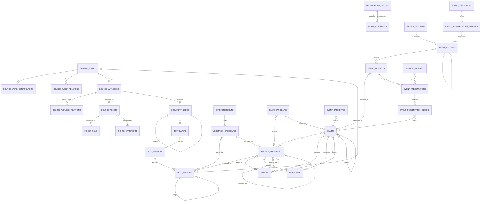
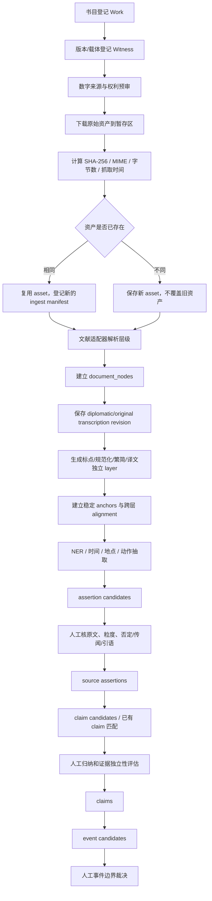
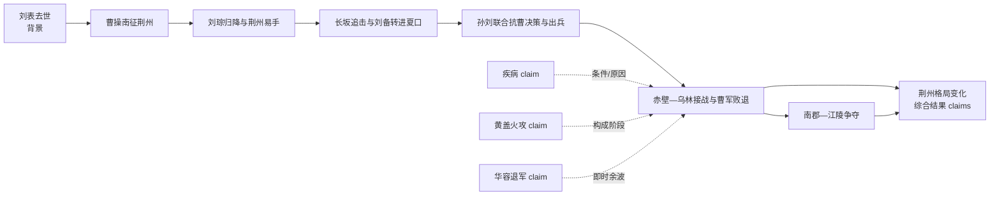

# ChronoAtlas 历史证据库、原文资料池与事件模型 v2

> 状态：第一阶段审计与目标设计，待讨论；不包含批量导入、生产迁移或现有数据删除。
>
> 审计日期：2026-08-09；审计数据库：`db/chronoatlas.sqlite`（只读，约 291 MiB）。

## 0. 结论先行

ChronoAtlas 当前最需要修复的不是“再加几张表”，而是重建一条有明确闸门的证据生产链：

```text
原始资产
  → 可追溯的文本版本与稳定锚点
  → 机器生成的来源陈述候选
  → 人工确认的来源陈述
  → 人工归纳的规范命题
  → 机器可建议、人工裁决的事件候选
  → 正式历史事件及层级关系
  → 经发布选择生成的事件卡、人物卡和专题页
```

当前数据库已经有可保留的实体、全文、候选卡、导入批次、事件和搜索基础，但实际数据绕过了中间层：`source_mentions` 有 26,325 条，`events` 有 1,678 条，`evidence_claims` 却是 0 条。自动提升脚本还能把候选写进前端直接读取的 `events`，而前端没有发布状态过滤。因此，v2 的第一原则是：

> 文本片段不是事件；来源陈述不是事实结论；规范命题不是页面文案；正式事件不是事件卡；“审核通过”也不等于“已经发布”。

建议采用“少数稳定实体表 + 明确的多对多关系表 + 只读展示投影”，而不是把每一种编辑状态都建成一套平行实体，也不再让 `raw_json` 承担核心语义。

---

## 1. 审计范围、保护边界与方法

### 1.1 已审阅范围

- `db/schema.sql`
- `db/migrations/001` 至 `030` 的结构、关键回填和稳定身份迁移，重点包括 002、003、006、014、016、017、029、030
- `db/seeds`、`scripts/export-sqlite-seed.mjs` 和 `scripts/lib/sqlite-seed-export.mjs`
- `scripts/build-history-db.mjs`
- 正史全文导入、证据卡暂存、规则抽取、语义候选导入、事件提升及赤壁人工 Seed
- `scripts/history-api-server.mjs`
- `src/main.tsx` 中人物卡、事件索引/详情、史料原文库、证据图谱
- `src/ContentGovernanceWorkbench.tsx`
- `docs/data-model.md`、`docs/history-database-architecture.md`、`docs/person-source-database-model.md`、`docs/evidence-graph-rag-eval-roadmap.md`
- `docs/evidence-pool-and-event-model-v1.md`，仅作为旧草案对照

### 1.2 工作区保护

审计开始时 Git 状态为：

```text
M  scripts/history-api-server.mjs
M  scripts/seed-china-310-589-persons-batch2.mjs
M  scripts/verify-stable-identity-links.mjs
M  src/main.tsx
?? db/migrations/030-person-identity-merges.mjs
?? docs/evidence-pool-and-event-model-v1.md
?? src/archive-context-pages.css
```

上述内容均视为用户已有工作。本设计没有改动这些文件，没有运行会删除并重建数据库的 `scripts/build-history-db.mjs`，也没有执行 Seed 导出、批量导入或迁移。

### 1.3 验证边界

- 数据库统计来自只读连接并启用 `PRAGMA query_only=ON`。
- 代码结论来自静态审阅；本阶段没有启动前端做浏览器交互测试。
- 历史示例用于验证模型是否能表达来源差异、转述依赖和事件边界，不代表本阶段已经完成逐字校勘。
- 网络文本只能作为待登记的数字来源，不能因网页可访问就自动成为“权威底本”。

---

## 2. 当前结构审计

### 2.1 当前主要数据量

| 对象 | 数量 | 当前含义与风险 |
|---|---:|---|
| `sources` | 1,128 | 作品、卷页、数字来源和人工小型来源混在一起 |
| `source_passages` | 7,596 | 被标为 `reviewed`，但多数只是自动清洗、自动切段的网页全文 |
| `source_mentions` | 26,325 | 272 条 reviewed，26,053 条 draft；既像引文，也像事件候选 |
| `import_evidence_cards` | 959 | 暂存证据卡，审核状态含义过宽 |
| `import_event_clusters` | 230 | 导入聚类，不等于经过史学判断的事件边界 |
| `events` | 1,678 | 1,192 draft、486 needs-review，没有 reviewed/approved |
| `historical_events` | 296 | 旧事件层，与 `events` 一对一映射 296 条 |
| `evidence_links` | 2,329 | 可直接把文本连到事件，绕过来源陈述和命题 |
| `evidence_claims` | 0 | 表已经存在，实际生产链未使用 |
| `observations` | 0 | 非文本证据扩展尚未落地 |
| `search_documents` / `document_chunks` | 29,793 / 29,793 | 派生检索层，不应成为证据事实来源 |

这些数量不是同一批数据的漏斗转化率，但足以说明结构性事实：系统在“文本片段”和“事件”两端堆积了大量记录，中间没有可用的规范命题层。

### 2.2 当前实际数据流

```mermaid
flowchart LR
    Web[网页 HTML] --> Clean[去标签、空白规范化]
    Clean --> Passage[source_passages\n自动切段且标 reviewed]
    Passage --> Sentence[按标点切句 + 关键词分类]
    Sentence --> Card[import_evidence_cards]
    Sentence --> Mention[source_mentions]
    Card --> Cluster[import_event_clusters]
    Cluster --> Promote[标题/年份/人物启发式聚合]
    Promote --> Event[events\nneeds-review]
    Passage --> Direct[evidence_links]
    Mention --> Direct
    Direct --> Event
    Event --> API[/api/frontend-events\n无发布过滤]
    API --> CardUI[事件卡 / 人物卡]
    Claims[evidence_claims] -. 当前为 0 .-> Event
```

### 2.3 数据库层的主要问题

#### A. `sources` 不是稳定的书目实体

正史全文导入脚本把一个网页目录项直接建成一条 `sources`，例如一卷或一页即一个 source ID。抽象作品、具体版本、数字化站点、抓取文件和文本转写没有独立身份，因此：

- 同一本书不同版本无法可靠并存；
- 同一网页更新会覆盖旧文本；
- 无法说明某段文字来自哪一种点校本或扫描本；
- 裴松之注中的宿主文献与被引佚书无法分别归属；
- `COUNT(DISTINCT source_id)` 会把不同网页当作不同独立证据。

#### B. “原文”实际上是清洗后的网页文本

`scripts/import-domestic-official-history-fulltext.mjs:168` 先去 HTML、导航和空白，再把结果写入 `source_passages`；没有保存原始响应字节、响应头、抓取时间、许可证、版权状态或内容校验值。脚本在新导入前删除该来源前缀下的 passage 和 search document（341–343 行），若网络中途失败，可能留下不完整的新状态。

结论：现有 passage 可以保留为“来源不完整的 legacy transcription”，但不能再称为不可变原始资产，也不能反推出原网页。

#### C. 切句器事实上在制造事件候选

`scripts/lib/rule-based-source-candidate-extractor.mjs:63` 按标点切句，105 行起用关键词分类，623/667 行把匹配句标为 `source-event-fact`，随后同时写证据卡和 `source_mentions`。这会产生三类误差：

1. 一句话多个动作被压成一个候选；
2. 同一动作跨句时被拆成多个候选；
3. 只因出现地名或战事词就被误认为相关事件。

当前赤壁检索中已经出现《晋书》别处的“赤壁”、人物籍贯“华容”、地理注释“南郡华容县”等无关候选，证明关键词命中不能承担事件身份判断。

#### D. 自动提升写入正式事件读模型

`scripts/promote-official-history-cards.mjs:556` 起按标题、年份、人物和地域构造 proposal，1232 行起匹配事件 ID，1333 行起直接 `INSERT INTO events`，机器生成记录标为 `needs-review`。虽然它没有声称已人工批准，但 `scripts/history-api-server.mjs:3214` 的 `/api/frontend-events` 查询没有 `review_status` 或 release 条件，因此机器候选仍可能进入事件索引、地图和人物页。

这是当前最优先的风险：审核状态和发布状态没有分离，且前端读取了混合层。

#### E. 命题表存在但生产方向倒置

迁移 014 建立了 `evidence_claims` 及来源、主体、关系表，但实际是空表。`scripts/seed-evidence-graph-sample-claims.mjs` 的做法是从已有事件和 `evidence_links` 反向生成一条摘要式 claim；这只能作为 UI 样例，不能作为证据建模流程，因为它先假定事件，再生成支持事件的命题。

此外：

- `evidence_claim_subjects.subject_table/subject_id` 是无外键约束的多态引用；
- `evidence_claim_sources` 用含 nullable 列的组合主键，在 SQLite 中不能稳定阻止含 NULL 的逻辑重复；
- `evidence_links` 同样用 `subject_table/subject_id` 绕过类型约束；
- 目前没有来源陈述、转述链或证据独立性实体。

#### F. Seed 是数据库快照，不是来源级可复现包

当前 Seed 导出按主键和列稳定排序，具备确定性，这是可保留优点；但它把整库表分为 core/runtime 后重新导出 SQL，仍以当前 SQLite 状态为事实来源。`scripts/build-history-db.mjs` 会删除目标数据库后重新建库，且没有真正的 migration ledger。

目标应改为：

- schema migration 负责结构；
- ingest manifest + 不可变资产负责原文可复现；
- 小型人工 curated seed 负责必要的初始规范数据；
- 检索、卡片和索引均可重建，不进入权威 Seed。

### 2.4 API 与页面层问题

| 页面/接口 | 现状 | 判断 |
|---|---|---|
| 事件索引与 `/api/frontend-events` | 直接读取全部非 `life:%` 的 `events` | 必须增加 release gate；这是数据治理问题，不只是 UI 问题 |
| 人物页 | `person_life_events`、`life:%` events、普通 events 三路并存，并以标题/年份启发式去重 | 生平节点和参与事件都应是 claim/event 的投影 |
| 事件详情 | 背景、经过、结果、影响在 JSON/数组文案中，无法逐条回溯 claim | 页面结构可保留，内容来源要改成带 claim 绑定的 presentation blocks |
| 史料原文库 | 按硬编码 source 前缀列“卷页”，用字符串判断“臣松之/松之案” | 阅读体验可保留；底层必须改为作品、见证版本、层级节点和文本层 |
| 证据图谱 | UI 已能展示 claim/source/subject，但数据库 claim 为 0 | 页面骨架可保留，API 必须改读 assertion → claim → event 链 |
| 治理工作台 | 只能改证据卡 status，缺审核人、理由、时间、规则版本与历史 | 应升级为多阶段审核队列；状态覆盖不能代替审计日志 |

### 2.5 能保留、必须改、仅展示层重做

#### 可以保留并演进

- `entities`、`entity_aliases`、`entity_i18n` 和最近增加的稳定人物/地点身份映射；
- 现有全文和引文，作为只读 legacy snapshot 原样保留；
- `import_batches`、文件 SHA、候选卡、聚类和提升来源关系，作为迁移审计线索；
- `search_documents`、chunks、FTS 和 embedding 思路，但明确为可重建派生层；
- 地图、地理实体、时期和纪年表；
- 证据图谱、史料阅读器、事件详情、人物页的交互骨架。

#### 必须改变

- 拆分作品、版本/载体、数字资产和文本转写；
- 将原文、标点、规范化、翻译分成不同文本层及不可变修订；
- 将 `source_mentions` 的“引文 + 事实 + 事件候选”职责拆开；
- 建立来源陈述和规范命题的正向生产链；
- 建立来源转述/依赖分组，不按书名或 source 行数计算独立证据；
- 把事件候选和正式事件分库内实体；
- 把审核决定与发布决定分离；
- 停止让卡片 JSON 成为历史事实的唯一承载体。

#### 主要是展示层问题

- 同一事件在人物卡和事件卡重复显示；
- 事件列表把大事件、阶段、子事件和人物生平节点按同一粒度平铺；
- 事件详情把“史料说明”和“不确定性”写成无结构自由文本；
- 原文库把网页页签当“书目/卷”；
- 图谱用“该事件能被哪些话支撑”的单向表达，无法展示冲突、限定和转述。

### 2.6 对旧 v1 草案的取舍

保留：

- 原始资产不可变；
- 文本锚点基于明确文本修订；
- 来源陈述、规范命题、事件边界和发布层分离；
- 自动化不得直接建立正式事件；
- 同源转述不得冒充独立证据；
- 事件可有不同分解方案。

推翻或延后：

- 不采用统一 `curated_record_series/revisions` 注册所有对象；改用有类型外键的领域表；
- 不把 Work/Object/Dataset 固定成三套所有文献都必须经过的实体；改为 Work/Witness/Asset，实物对象可在非文本证据分支扩展；
- 不在第一阶段建立多层 publication series/content revision/release revision；先用 presentation + release selection；
- 不把 event hypothesis 再拆成多层注册实体；用事件候选、审核决定、正式事件三层即可；
- 不为每个普通编辑字段建立修订表，只有原始资产、文本、事件边界和正式展示文案需要不可覆盖的版本历史。

---

## 3. 核心概念定义

| 概念 | 定义 | 不是 |
|---|---|---|
| 文献作品（Work） | 抽象的智力作品，如陈寿《三国志》、司马光《资治通鉴》 | 某个网页、某一册扫描 PDF |
| 见证版本（Witness） | 某一具体抄本、刻本、点校本、数据库转写或辑佚本 | 抽象书名 |
| 原始资产（Asset） | 实际获取的文件/字节流及其校验值、来源、抓取时间和权利状态 | 清洗后覆盖写入的 passage |
| 文档节点（Document node） | 某一 witness 内的层级结构节点，类型可为卷、纪、传、年条、页、栏、行、段等 | 强迫所有文献采用同一切分层级 |
| 文本层（Text layer） | 节点上的原样转写、标点、规范化、译文等独立系列 | 同一字段的随手覆盖 |
| 文本修订（Text revision） | 文本层一次不可变内容快照；修订新增而不覆盖 | 当前值就地修改 |
| 文本锚点（Anchor） | 指向某个不可变文本修订的字符范围或图像区域 | 只有“卷五十四”这样的模糊 citation |
| 来源陈述（Source assertion） | 某个叙述者/文献在一个或多个锚点上表达的原子化陈述 | 系统已经判定为真的历史事实 |
| 规范命题（Claim） | 研究者把一条或多条来源陈述对齐后形成的、可支持/冲突/限定的历史命题 | 页面摘要，或整场事件 |
| 传承组（Transmission group） | 对同一文本传统、转述链或共同底本的分组，用于判断证据独立性 | 书名不同就算独立来源 |
| 事件候选（Event candidate） | 基于已审命题形成的可审查聚类或边界建议 | 正式事件或公开事件卡 |
| 正式事件（Event record） | 人工裁决后建立的稳定历史事件身份 | 一句话、一段文本、一张 UI 卡 |
| 事件修订（Event revision） | 某次对事件边界、粒度和纳入命题的正式版本 | 覆盖掉旧边界 |
| 事件簇/专题（Event collection） | 把背景、核心、余波和相关正式事件组织为研究/阅读集合 | 必然等于一个历史事件 |
| 展示文案（Presentation） | 面向特定语言/受众的标题、摘要和段落，并绑定所依据的 claims | 原文或规范命题本体 |
| 发布（Release） | 明确选择哪些 event revision + presentation 进入某个页面/API 渠道 | `review_status='approved'` 的同义词 |

### 3.1 “来源陈述”和“规范命题”的最小例子

```text
来源陈述 A：
《三国志·武帝纪》在建安十三年条记述，曹操军在赤壁交战不利，军中发生疫病并退军。

来源陈述 B：
《三国志·周瑜传》记述，曹操军初战失利前已有疾病。

规范命题 C1：
曹操军在赤壁接战阶段存在显著疫病。

规范命题 C2：
疫病是曹操退军的原因之一。
```

A、B 可以共同支持 C1；A 对 C2 支持较强，B 只能限定时间关系。C1 与 C2 不能合并，因为“发生疫病”和“疫病造成退军”是两个不同命题。

---

## 4. 不可破坏的设计不变量

1. 原始资产以字节校验值固定，永不覆盖；新抓取形成新 asset。
2. 原样转写、标点、规范化、繁简转换和译文是不同 text layer。
3. text revision 一旦被 anchor 引用，不得修改；修订只能新增。
4. anchor 必须指向明确 revision，并保存代码点范围、精确引文及前后文校验。
5. 机器只能创建 assertion candidate、claim candidate 和 event candidate。
6. source assertion、claim、formal event 都必须有人工决定记录。
7. 正式事件至少关联一个已审 claim；event 不得只直接连接一段 quote。
8. 一个 anchor 可支撑多条 assertion；一条 assertion 可关联多个 claim；一条 claim 可进入多个 event revision。
9. 同一底本的转写、标点本、译文和后世转述不按行数重复计为独立证据。
10. 冲突时间、地点和因果判断以并存选项保存，不覆盖异议。
11. 页面 API 只读取 release 选择的 revision，不读取所有 draft/approved 记录。
12. `raw_json` 只保存适配器或外部系统的非核心扩展，不保存必须查询和约束的历史语义。
13. 任何迁移只追加、映射或建立兼容视图；旧记录在验收前不删除。

---

## 5. 推荐数据分层

### L0：书目与来源谱系

解决“这是什么作品、哪一个版本、由谁编撰、是否引用/翻译/辑佚另一作品”。

### L1：资产、权利与导入可复现性

解决“从哪里取得、何时取得、原文件是什么、是否允许存储/展示/索引、这次导入能否重放”。

### L2：文档结构、文本层和稳定锚点

解决“如何定位到卷、篇、传、年条、页、段和字符范围；不同标点/译文如何并存”。

### L3：来源陈述

解决“某一文献实际说了什么”，保留叙述者、语气、否定、传闻、引语和不确定性。

### L4：规范命题与证据评估

解决“多条来源陈述是否表达同一历史主张，互相支持、冲突、限定还是转述”，并处理证据独立性。

### L5：事件候选、事件裁决和正式事件

解决“哪些命题构成一个可理解的历史变化单元、边界如何划定、何时合并或拆分”。

### L6：事件簇、专题、人物档案与展示发布

解决“如何向用户组织大事件、阶段、子事件、背景、结果和长期影响”，但不反向污染证据层。

### L7：检索、RAG、卡片与统计投影

全部可重建。搜索文档、向量、事件卡 DTO、人物生平 DTO 和图谱响应都不作为历史证据实体。

---

## 6. 实体表、关系表与投影的边界

### 6.1 必须是独立实体表

- `source_works`
- `source_witnesses`
- `source_assets`
- `rights_statements`
- `ingest_runs`
- `document_nodes`
- `text_layers`
- `text_revisions`
- `text_anchors`
- 现有 `entities`
- `time_spans`
- `extraction_runs`
- `assertion_candidates`
- `source_assertions`
- `transmission_groups`
- `claim_candidates`
- `claims`
- `event_candidates`
- `review_decisions`
- `event_records`
- `event_revisions`
- `event_collections`
- `event_decomposition_schemes`
- `event_presentations`
- `content_releases`

这些对象都有独立生命周期、稳定身份或审计价值，不能只藏在 JSON 中。

### 6.2 应当是关系表

- 作品—作者/编者/注者/译者
- 作品—作品的引用、汇编、续作、翻译关系
- witness—witness 的据本/复制/校勘关系
- import run—asset
- anchor—被归属的佚书/引文作品
- candidate/assertion—anchor
- assertion/claim/event—人物、地点、政权、官职等 entities
- assertion/claim/event—time span
- assertion—assertion 的转述/依赖/冲突
- claim—assertion 的支持、冲突、限定及 transmission group
- claim—claim 的蕴含、因果、细化、互斥
- candidate—claim
- event revision—claim
- event—event 的 part-of、precedes、causes、overlaps、results-in
- collection/scheme—event 的背景、阶段、核心、余波、长期影响成员关系
- presentation block—claim
- release—presentation/event revision

核心语义关系使用有类型外键。只有治理日志这类跨对象审计可以使用受控的 `object_type/object_id`，并由应用层和校验器保证目标存在。

### 6.3 只应是展示或派生结果

- 事件卡
- 人物卡
- 人物生平年表卡
- 专题首页卡
- “相关事件”列表
- 背景/经过/结果/影响的页面区块布局
- 证据图谱节点和边
- 搜索文档、RAG chunk、embedding
- 事件/人物/地点统计计数

可以持久化展示文案和发布选择，但不能持久化一张与正式事件平行、拥有自己历史事实字段的“事件卡实体”。

---

## 7. ER 图



---

## 8. 表结构草案与关键约束

以下是逻辑物理设计，不是本阶段要立即执行的 migration。`M1` 表示最小可用证据内核，`M2` 表示事件与发布切换，`E` 表示可延后扩展。

### 8.1 书目、版本、资产与导入

| 表 | 阶段 | 关键字段 | 关键约束 |
|---|---|---|---|
| `source_works` | M1 | `id`, `title`, `work_kind`, `language`, `date_label`, `date_start/end`, `availability_status`, `evidence_domain` | 作品身份不依赖书名字符串；佚书也可建 work |
| `source_work_contributors` | M1 | `work_id`, `entity_id`, `role`, `ordinal`, `certainty` | 角色为 author/compiler/commentator/editor/translator 等 |
| `source_work_relations` | M1 | `from_work_id`, `to_work_id`, `relation_type`, `certainty`, `note` | quotes/compiles/translates/continues/revises 等；不能直接证明逐条依赖 |
| `source_witnesses` | M1 | `id`, `work_id`, `witness_type`, `edition_statement`, `publisher`, `publication_date`, `shelfmark`, `catalog_uri`, `fidelity_status` | 同书不同版本独立；`fidelity_status` 区分影印、校勘、网页转写、legacy |
| `source_witness_relations` | M1 | `from_witness_id`, `to_witness_id`, `relation_type`, `note` | reproduces/collated_from/digitizes/derived_from |
| `source_assets` | M1 | `id`, `witness_id`, `asset_kind`, `origin_uri`, `retrieved_at`, `media_type`, `byte_length`, `sha256`, `storage_uri`, `http_metadata_json` | `sha256` 唯一；资产不可覆盖；HTTP 元数据非核心可放 JSON |
| `rights_statements` | M1 | `id`, `status`, `license_uri`, `rights_holder`, `jurisdiction`, `allow_store/display/index/quote`, `reviewed_at`, `note` | `unknown` 不等于可公开全文 |
| `asset_rights` | M1 | `asset_id`, `rights_id`, `effective_from/to` | 一项资产可随时间有不同权利判断 |
| `ingest_runs` | M1 | `id`, `manifest_sha256`, `adapter_key`, `adapter_version`, `parameters_sha256`, `status`, `started_at`, `completed_at`, `supersedes_run_id` | 唯一键 `(manifest_sha256, adapter_version, parameters_sha256)` 保证幂等 |
| `ingest_run_assets` | M1 | `run_id`, `asset_id`, `role`, `ordinal` | 只有全部资产/结构/校验成功后 run 才可 committed |

原始 asset 的字节内容可以采用按 SHA-256 寻址的本地文件库或对象存储，不要求把大型 PDF/图像全部塞进 SQLite BLOB；但数据库中的 `storage_uri + sha256 + byte_length` 必须足以做完整性校验、备份和恢复。可直接管理的小型纯文本也可内联保存。无论采用哪种介质，只有转写文本而没有原始资产快照，都不算完成 L1 保存。

### 8.2 文档结构、文本与锚点

| 表 | 阶段 | 关键字段 | 关键约束 |
|---|---|---|---|
| `document_nodes` | M1 | `id`, `witness_id`, `parent_id`, `node_type`, `node_key`, `ordinal`, `label`, `locator_path`, `layer_role`, `adapter_metadata_json` | `UNIQUE(witness_id,node_key)`；node_type 开放词表；不规定统一深度 |
| `text_layers` | M1 | `id`, `node_id`, `layer_kind`, `language`, `script`, `base_layer_id`, `normalization_profile` | layer_kind 为 diplomatic/punctuated/normalized/translation/commentary 等；互不覆盖 |
| `text_revisions` | M1 | `id`, `layer_id`, `revision_no`, `content`, `content_sha256`, `derived_from_revision_id`, `source_asset_id`, `created_at`, `created_by` | `UNIQUE(layer_id,revision_no)`；被 anchor 引用后不可 UPDATE/DELETE |
| `text_anchors` | M1 | `id`, `text_revision_id`, `start_cp`, `end_cp`, `exact_text`, `prefix_text`, `suffix_text`, `exact_sha256`, `public_urn` | Unicode code point、左闭右开；范围与 exact 必须校验；同 revision 上确定性生成 |
| `text_alignments` | M1 | `from_anchor_id`, `to_anchor_id`, `alignment_type`, `confidence`, `method`, `review_status` | equivalent/variant/translation/normalization/partial-overlap |
| `anchor_attributions` | M1 | `anchor_id`, `attributed_work_id`, `attribution_type`, `attribution_text`, `certainty` | 处理“裴注曰《江表传》……”；宿主 anchor 不复制成虚假独立原文 |

`text_anchors` 同时保存位置选择器和精确引文/前后文，思路与 W3C Web Annotation 的 TextPositionSelector + TextQuoteSelector 相容；若来源提供扫描图像，可额外保存 IIIF Canvas/xywh selector，而不改变文本核心表。

### 8.3 实体、时间和来源陈述

| 表 | 阶段 | 关键字段 | 关键约束 |
|---|---|---|---|
| 现有 `entities` | M1 | `id`, `entity_type`, label/i18n/aliases, temporal scope | 保留并扩展 person/place/polity/office/group/organization/object；旧 persons/places 通过 mapping 兼容 |
| `calendar_systems` | M1 | `id`, `label`, `epoch/conversion_policy`, `version` | 中国年号、儒略历等显式登记；转换算法有版本 |
| `time_spans` | M1 | `id`, `calendar_system_id`, `original_expression`, start/end 年月日, `not_before/not_after`, `precision`, `certainty`, `conversion_method` | 使用天文年号；允许 relative/unknown；原始表达永远保留 |
| `extraction_runs` | M1 | `id`, `ingest_run_id`, `extractor_key/version`, `model_id`, `prompt_or_rules_sha256`, `parameters_json`, `created_at` | 任何自动输出必须能回溯模型/规则和输入 revision |
| `assertion_candidates` | M1 | `id`, `extraction_run_id`, `predicate_key`, `proposed_statement`, `polarity`, `modality`, `payload_sha256`, `status` | 仅候选；不得被公开事件 API 读取 |
| `assertion_candidate_anchors` | M1 | `candidate_id`, `anchor_id`, `role`, `ordinal` | 一段多动作可生多 candidate；一个 candidate 可跨多 anchor |
| `source_assertions` | M1 | `id`, `accepted_from_candidate_id`, `narrating_work_id`, `assertion_mode`, `predicate_key`, `statement`, `polarity`, `modality`, `status`, `supersedes_assertion_id` | 人工确认后创建；原子化；修正建新记录而非覆盖 |
| `assertion_anchors` | M1 | `assertion_id`, `anchor_id`, `role`, `ordinal` | role 为 direct_text/context/attribution/editor_note |
| `assertion_entities` | M1 | `assertion_id`, `entity_id`, `semantic_role`, `certainty` | agent/patient/beneficiary/office_holder/quoted_speaker 等 |
| `assertion_times` | M1 | `assertion_id`, `time_span_id`, `role`, `certainty` | reported_time/narrative_time/inferred_time |
| `assertion_places` | M1 | `assertion_id`, `place_entity_id`, `role`, `certainty` | reported/location/origin/destination/route 等 |
| `assertion_relations` | M1 | `from_assertion_id`, `to_assertion_id`, `relation_type`, `basis`, `review_status` | quotes/restates/depends_on/contradicts/corrects；逐条表达依赖 |
| `transmission_groups` | M1 | `id`, `label`, `basis_note`, `review_status` | 同一传承链的证据分组；不同书名不自动生成不同组 |

### 8.4 规范命题与证据评估

| 表 | 阶段 | 关键字段 | 关键约束 |
|---|---|---|---|
| `claim_candidates` | M1 | `id`, `generator`, `proposed_predicate`, `proposed_statement`, `match_claim_id`, `status` | 机器可建议合并/新建，不可直接成为 claim |
| `claim_candidate_assertions` | M1 | `claim_candidate_id`, `assertion_id`, `proposed_stance`, `similarity`, `reason` | 保留候选聚合依据 |
| `claims` | M1 | `id`, `claim_domain`, `claim_type`, `predicate_key`, `statement`, `polarity`, `modality`, `status`, `supersedes_claim_id` | accepted claim 不原地改写；历史发生、史学解释、接受史分域 |
| `claim_assertions` | M1 | `claim_id`, `assertion_id`, `stance`, `directness`, `transmission_group_id`, `assessment_status`, `assessment_note`, `decision_id` | support/conflict/qualify/context；证据独立性在此评估 |
| `claim_entities` | M1 | `claim_id`, `entity_id`, `semantic_role`, `certainty` | 用类型外键，不使用 subject_table |
| `claim_times` | M1 | `claim_id`, `time_span_id`, `stance`, `is_preferred`, `decision_id` | 多个时间选项并存；preferred 是审核结论而非删除其他选项 |
| `claim_places` | M1 | `claim_id`, `place_entity_id`, `role`, `stance`, `is_preferred`, `decision_id` | 允许赤壁/乌林、夏口/樊口等争议并存 |
| `claim_relations` | M1 | `from_claim_id`, `to_claim_id`, `relation_type`, `status`, `decision_id` | entails/refines/contradicts/causes/enables/depends_on；因果需单独审核 |

现代研究著作可以进入 `source_works`，其来源陈述进入 `source_assertions`，但 `claim_domain=historical_occurrence` 的直接史料证据和 `claim_domain=scholarly_interpretation` 的研究判断必须分开。研究著作可以支持“某学者主张 X”或对证据的解释，不能伪装成第二条古代独立见证。

### 8.5 事件候选、正式事件、事件簇与发布

| 表 | 阶段 | 关键字段 | 关键约束 |
|---|---|---|---|
| `event_candidates` | M2 | `id`, `generator/version`, `proposed_label`, `proposed_scale`, `boundary_note`, `match_event_id`, `status` | 只从 accepted/reviewed claims 聚类；不进公开 API |
| `event_candidate_claims` | M2 | `candidate_id`, `claim_id`, `proposed_role`, `similarity`, `reason` | 角色为 constitutive/background/result 等 |
| `review_decisions` | M1 | `id`, `object_type`, `object_id`, `decision_type`, `outcome`, `reviewer_id`, `reason`, `policy_version`, `created_at`, `supersedes_decision_id` | 追加式审计日志；outcome 不覆盖历史；治理层允许受控多态 |
| `event_records` | M2 | `id`, `event_kind`, `event_scale`, `lifecycle_status`, `created_from_decision_id`, `supersedes_event_id`, `created_at` | 只有 outcome=promote_to_event 的决定可授权创建 |
| `event_revisions` | M2 | `id`, `event_id`, `revision_no`, `boundary_definition`, `granularity_rationale`, `status`, `created_by`, `created_at` | `UNIQUE(event_id,revision_no)`；正式边界变更新增 revision |
| `event_revision_claims` | M2 | `event_revision_id`, `claim_id`, `role`, `ordinal`, `decision_id` | constitutive/prerequisite/background/immediate_result/long_term_impact/contested |
| `event_revision_times` | M2 | `event_revision_id`, `time_span_id`, `role`, `is_adopted`, `decision_id` | adopted/alternative/disputed；不得用单个年份覆盖冲突 |
| `event_revision_places` | M2 | `event_revision_id`, `place_entity_id`, `role`, `is_adopted`, `decision_id` | battle_site/route/decision_site/operational_area 等 |
| `event_relations` | M2 | `from_event_id`, `to_event_id`, `relation_type`, `basis_claim_id`, `decision_id` | part_of/precedes/overlaps/causes/enables/results_in/same_as；方向明确 |
| `event_collections` | M2 | `id`, `collection_kind`, `label`, `scope_note`, `status` | 事件簇/专题不是正式事件 |
| `event_decomposition_schemes` | E | `id`, `collection_id`, `label`, `scope_rule`, `status`, `is_adopted` | 支持窄/中/宽边界或不同学术方案 |
| `event_collection_members` | M2 | `collection_id`, `scheme_id`, `event_id`, `member_role`, `ordinal`, `note` | background/opening/core/phase/aftermath/long_term；同一事件可进多个集合 |
| `event_presentations` | M2 | `id`, `event_revision_id`, `locale`, `audience`, `title`, `short_summary`, `status`, `revision_no` | 展示文案与历史事件边界分开 |
| `event_presentation_blocks` | M2 | `id`, `presentation_id`, `section_type`, `ordinal`, `body` | background/process/result/impact/uncertainty 等页面块 |
| `presentation_block_claims` | M2 | `block_id`, `claim_id`, `citation_role` | 每段事实文案可回溯到命题；纯导航/导语可显式标 editorial_only |
| `content_releases` | M2 | `id`, `channel`, `version`, `status`, `released_at`, `released_by` | 审核通过不自动发布 |
| `release_items` | M2 | `release_id`, `event_revision_id`, `presentation_id`, `public_slug`, `sort_key` | 公开 API 只读 active release items |

事件参与人物、地点和时间默认从 `event_revision_claims → claim_*` 聚合。只有“展示排序”或“事件整体边界选择”需要 event revision 自己的关系，避免把同一事实复制到事件和命题两层。

### 8.6 可保留的非文本证据分支

现有 `observations` 不应删除。碑铭、钱币、考古层位、图像和地理测量可按如下扩展：

```text
physical/digital asset → observation → claim_observations → claim → event
```

它与文本 assertion 平行，而不是强行伪装成“文献句子”。这使模型能够支持罗马铭文、波斯岩刻、钱币、纸草和考古证据。

---

## 9. 主键、外键和稳定标识策略

### 9.1 主键

- 人工确认后拥有长期身份的对象（work、witness、entity、assertion、claim、event）使用 UUIDv7 文本主键。
- `title + year`、文件序号、句子序号、数组 index 不作为稳定主键。
- 公共 URL 使用单独 `public_slug`/alias；改标题不改主键。
- 外部权威号放入 `external_identifiers(object_type, object_id, scheme, value, uri)`，不直接取代内部主键。

### 9.2 内容寻址对象

- asset 以 SHA-256 去重，主键仍用 UUID，避免把哈希算法锁死在所有外键中。
- text revision 保存内容 SHA-256；相同字节可检测重复，但不同 witness 不自动合并身份。
- anchor 可用 UUIDv5 从 `text_revision_id + start_cp + end_cp + exact_sha256` 确定性生成。
- candidate 可用 UUIDv5 从 `run_id + anchor IDs + proposal payload hash` 生成，不能依赖数组顺序。

### 9.3 外键原则

- 历史语义关系必须用真实 FK；不再新增 `subject_table/subject_id` 型核心表。
- 多对多关系使用代理主键或完整非空唯一键；不要把 nullable 列放进复合主键期待 SQLite 去重。
- `ON DELETE CASCADE` 仅用于纯派生候选/关系；资产、文本修订、assertion、claim、event 和审核决定不得物理级联删除。
- 退役使用 `status/retired_at/supersedes_*`，不删除。

### 9.4 稳定引用 URI

建议：

```text
urn:chronoatlas:work:<uuid>
urn:chronoatlas:witness:<uuid>
urn:chronoatlas:text-revision:<uuid>
urn:chronoatlas:anchor:<uuid>
urn:chronoatlas:claim:<uuid>
urn:chronoatlas:event:<uuid>
```

引用解析页面可展示：作品 → 版本 → 卷/篇/传/段 → 文本层/修订 → 字符范围 → 原始资产/许可证。

---

## 10. 原文导入规范

### 10.1 完整链路



### 10.2 导入事务与幂等性

1. 先把所有远程资产下载到隔离暂存区，生成 manifest；不能先删除数据库旧记录。
2. 校验 HTTP 状态、MIME、字节数、编码、SHA-256 和最低内容阈值。
3. manifest 包含书目 ID、witness ID、每个 asset、适配器及版本、参数、时间、操作者和软件版本。
4. 相同 `manifest_sha256 + adapter_version + parameters_sha256` 再运行时返回已有 committed run，不重复写入。
5. 资产改变时创建新 asset 和新 ingest run；旧 run 保留并由 `supersedes_run_id` 连接。
6. 文档结构、文本层、anchor 和索引先写 shadow/new revision；全部约束和计数通过后，一次事务提交 active pointer。
7. 导入失败只把 run 标为 failed，不改变当前 active witness/text revision。
8. 搜索索引在提交后异步重建；索引失败不得回滚原始资产和文本。

### 10.3 原文、标点、规范化和译文

| 层 | 允许处理 | 禁止处理 |
|---|---|---|
| `diplomatic` | 按底本转写，保留异体、缺字、换行/页栏信息 | 自动繁简、改字、补标点后仍称原文 |
| `punctuated` | 增加标点和必要分段，记录编辑者/规则 | 覆盖 diplomatic |
| `normalized` | Unicode 规范、异体映射、繁简检索形、专名规范化 | 用于直接引用时冒充底本文字 |
| `translation` | 现代汉语/外语翻译，可多次修订 | 修改时删除旧译文或改变原文 anchor |
| `commentary/editorial` | 校勘记、注释、研究说明 | 与宿主原文混成一个无来源字段 |

译文修订只生成新的 text revision；原文 anchor 保持不变，译文 anchor 通过 `text_alignments` 对齐。若原样转写本身发现错误，则创建新 diplomatic revision，并把旧 anchor 对齐到新 anchor；旧引用仍可解析。

### 10.4 精确锚点规范

- 字符位置使用 Unicode code point，不使用 JavaScript UTF-16 `string.length/slice` 结果作为学术锚点。
- 范围为 `[start_cp, end_cp)`。
- 同时保存 exact text、前缀、后缀和 exact SHA-256。
- 人类 citation path 保存卷、篇、传、年条、页、栏、行、段等，但不作为唯一身份。
- 扫描件另存 `canvas_uri + xywh`；OCR 文本 anchor 与图像区域对齐。
- 文本修订变化后不“平移旧 offset”；创建新 anchor 和显式 alignment。

### 10.5 去重分层

| 层级 | 去重依据 | 不应自动合并的情况 |
|---|---|---|
| 资产 | 完整字节 SHA-256 | 同内容但来源/权利不同可复用 bytes，不合并 provenance |
| 文本修订 | layer 内内容 hash | 不同 witness 相同文本仍保留各自身份 |
| anchor | revision + code point range + exact hash | 不跨 revision 复用 offset |
| 来源陈述候选 | anchor 集 + extractor version + payload hash | 同句多动作必须是多个候选 |
| 来源陈述 | 人工判断同一叙述行为 | 后世转述与早期记载不能合并成一条 assertion |
| 规范命题 | 同一主语/谓词/对象/时空/模态 | 发生命题与因果命题不能合并 |
| 事件 | 同一变化单元和边界裁决 | 仅标题相似或同年同人不能合并 |

---

## 11. 不同文献类型的适配规则

统一的是 Work/Witness/Asset/Node/Layer/Revision/Anchor，不统一的是 node hierarchy 和 assertion extractor。

| 文献类型 | 推荐层级 | 切分/抽取注意事项 |
|---|---|---|
| 纪传体正史 | 书 → 纪/志/表/传 → 卷 → 人物/主题 → 段/注 | 人物传不是事件边界；同段可有多动作；正文与注分层 |
| 编年体 | 书 → 卷 → 皇帝/年号 → 年/月/日条 → 叙事段 | “大赦天下”等例行年条默认背景；长条叙事需按动作和因果拆 assertion，不按句拆事件 |
| 地方志/区域史 | 书 → 区域/人物/政权 → 条目 → 段 | 地方传统可支持区域视角；需判断是否转述中央史书 |
| 地理注释 | 书 → 水系/路线 → 地点条 → 引文/地貌说明 | 优先生成地点、路线和地名沿革 claims；不因提到战役就生成战役事件 |
| 注疏/夹注 | 宿主节点 → 正文 span → 注者 span → 被引文献 span | 保存宿主、注者和被引作品三重角色；引用佚书用 anchor attribution |
| 辑佚文献 | 辑佚本 Work/Witness → 佚文条 → 宿主 citation → fragment | 佚书 Work 与现代辑佚本 Work 分开；fragment 的存世见证仍是宿主文本 |
| 现代学术著作 | 书/论文 → 版次 → 页/章节 → 段 | 进入 scholarly interpretation；受版权限制时只存元数据、页码和许可范围内摘录 |
| 文学/接受史 | 作品 → 版本 → 回/章/场景 | assertion/claim 标记 reception/literary；不得作为历史发生命题的支持证据 |
| 碑铭/钱币/纸草 | 对象 → 面/区域 → 行/字 → 转写 | 原物、影像、转写和释读分层；通过 observation 分支进入 claim |
| 考古报告/GIS | 数据集/报告 → 单元/层位/要素 → observation | 数据版本、坐标系、测量方法和不确定性必须保存 |

### 11.1 裴松之注与佚书的建模

以《江表传》片段为例：

1. `source_works` 建立《三国志》《江表传》两个 Work；《江表传》标 `availability_status=lost_fragmentary`。
2. `source_witnesses` 登记某一《三国志》版本；其卷 54 为宿主 witness 的 document nodes。
3. 正文、裴注和裴注内标明“《江表传》曰”的引文分别成为有顺序的子节点/text layer。
4. 片段文本只在宿主 witness 中保存一次。
5. `anchor_attributions` 把片段 anchor 归属到《江表传》，attribution_type=`quoted_fragment`。
6. source assertion 的 `narrating_work_id` 可指《江表传》，但 assertion anchor 仍指向《三国志》裴注中的存世位置。
7. claim 评估同时记录：底层叙述作品是《江表传》，唯一存世传递载体是裴注，不能把两者算成两条独立证据。

《山阳公载记》《汉晋春秋》等同理。现代辑佚本是新的 witness/现代编纂 work，不覆盖宿主引文。

---

## 12. 重新定义事件卡与事件边界

### 12.1 什么只属于时代背景

默认不建独立事件卡，但可保留 assertion/claim 的记录包括：

- 例行性、公式化且未显示具体状态改变的纪年记录，如一般“大赦天下”；
- 只说明某地、某官职或某人籍贯的静态描述；
- 对事件发生环境的疾病、气候、制度背景，但无法单独界定行动和结果者；
- 后世概括、赞颂或文学修辞；
- 仅用于定位的地理沿革说明。

例外：一次大赦若与政权更替、叛乱善后、法律状态改变或特定群体命运直接相关，可在相应粒度下成为正式事件。规则不是按词语屏蔽，而是判断是否形成可辨识的状态变化。

### 12.2 什么是来源陈述

来源陈述必须能回答：

- 谁/哪部作品在说？
- 具体锚点在哪里？
- 说了一个什么原子动作或状态？
- 是肯定、否定、传闻、引语、推测还是评论？
- 时间、地点、人物和对象是原文明确表达还是后人推断？

一段原文包含五个动作，就可产生五条 assertion；同一句同时说明联盟形成和开战，也可产生两条 assertion，并共享同一个 anchor。

### 12.3 什么可以成为子事件

满足以下多数条件时，才值得成为子事件：

1. 有可识别的行动或状态改变；
2. 相比父事件有更窄的时间、地点、参与者或目标；
3. 有独立的开始/结束或结果；
4. 用户有独立检索、比较或地图定位价值；
5. 至少一个已审 claim 是其 constitutive claim；
6. 拆分不会只剩一条同义叙述。

### 12.4 什么可以聚合成大事件

多个正式事件可聚合为 campaign/transition/complex，需有明确聚合理由：

- 因果连续：前一节点直接创造后一节点的条件；
- 时空连续：在同一行动区域和相近时间内连续展开；
- 行动目标连续：同一战略、政治或社会变化过程；
- 用户理解：合并后更能说明变化，而非只因为都发生在同一年。

### 12.5 合并、同一事件的不同叙述与真正拆分

#### 应合并为同一事件身份

- 多部史书描述相同核心行动、参与者、时空和结果；
- 一部传记突出甲方，另一部突出乙方，但仍是同一交战；
- 赤壁/乌林是同一战区内不同命名或阶段，证据不足以证明两场独立战役；
- 翻译、标点本、后世编年转述同一记载。

这些差异留在 assertions、claims、时间/地点选项和 transmission groups 中。

#### 应拆成不同事件

- 行动主体或目标发生明显转换；
- 时间/地点出现可辨识间隔；
- 一个行动已经结束并产生结果，随后开启新行动；
- 争议只影响其中一个阶段，拆开能精确表达；
- 独立比较价值高，例如外交结盟与随后军事接战。

#### 暂不决定

若边界证据不足，保留一个 event candidate 或 collection member，标 `defer/boundary_uncertain`，不要为了填卡而提前发布。

### 12.6 时间和地点冲突

- 每条 source assertion 保留其原文时间/地点表达；
- claim 层保存多个 time/place 选项及 stance；
- event revision 可选择 adopted 方案，但所有 alternative/disputed 方案仍在；
- 页面显示“约”“不晚于”“一说……”并链接冲突 claims；
- 新研究改变判断时新增 decision/event revision，不覆盖旧判断。

### 12.7 自动化边界

允许自动化：

- 文本结构建议、NER、时间/地点/动作抽取；
- assertion candidate；
- claim 相似度、转述相似度和已有 claim 匹配建议；
- event candidate 聚类、可能重复和边界建议；
- 数据质量检查和影响预览。

禁止自动化：

- 把 passage/sentence 直接建成 source assertion 的 accepted 状态；
- 自动创建 accepted claim；
- 自动创建 formal event；
- 自动把 approved 记录放入 active release；
- 因来源数多自动提高独立证据等级；
- 用翻译或现代改写回填原文。

---

## 13. “赤壁之战”贯穿案例

### 13.1 材料角色与证据依赖

| 材料 | 进入库的身份 | 对赤壁簇的主要贡献 | 独立性处理 |
|---|---|---|---|
| 《三国志·武帝纪》 | 早期正史 Work 的本纪节点 | 曹操南征、赤壁不利、疫病、退军 | 对曹方叙述重要；与同书其他传记不能简单按卷计独立 |
| 《先主传》 | 同 Work 的人物传记节点 | 长坂后续、诸葛亮联孙、并力、火烧舟船、荆州后续 | 刘备视角；与吴志叙事对齐而非再造一张赤壁卡 |
| 《诸葛亮传》 | 同 Work 的人物传记节点 | 刘琮降、刘备失势、诸葛亮出使及说孙权 | 外交阶段 claims |
| 《吴主传》 | 同 Work 的人物传记节点 | 孙权内部决策、周瑜程普领军、赤壁交战 | 吴方决策和指挥 claims |
| 《周瑜鲁肃吕蒙传》 | 同 Work 的人物传记节点 | 鲁肃接触、内部议论、初战、疾病、黄盖火攻、追击、江陵 | 核心细节丰富；正文与裴注必须分层 |
| 裴松之注引《江表传》 | 佚书 Work + 宿主 anchor | 孙权决策场景、黄盖诈降书、火攻细节 | 底层作品与宿主传递载体各记一次，不双计 |
| 裴注引《山阳公载记》 | 佚书 Work + 宿主 anchor | 船舰归因、华容道撤退、泥泞与填路 | 与《通鉴》同段建立转述依赖 |
| 裴注引《汉晋春秋》 | 佚/辑佚 Work + 宿主 anchor | 刘琮投降后建议、后续评价等 | 具体 claim 逐条评估，不因书名不同自动独立 |
| 《后汉书·孝献帝纪》 | 后出正史的纪年节点 | 将 208 年概括为周瑜败曹操于乌林、赤壁 | 支持日期和事件存在；细节较少，属后出综合叙述 |
| 《华阳国志·刘先主志》 | 地方/区域史 Work | 刘备—诸葛亮—孙权链及火烧舟船的蜀地叙事 | 可作区域传统；判断是否依赖《三国志》需 claim 级评估 |
| 《资治通鉴》卷 65 | 后世编年综合 Work | 形成连续时间线：鲁肃、诸葛亮、孙权决策、火攻、华容、江陵 | 高价值叙事索引，但大量依赖更早材料，不能按新书名重复计证 |
| 《水经注》及《荆州记》传统 | 地理著作/佚书引文 | 赤壁、乌林、水道、地貌和地点记忆 | 主要进入地点假说/历史地理 claims，不直接替代战事来源 |
| 现代史学著作/论文 | modern scholarship | 来源批判、兵力、地点、疫病、事件边界分析 | 进入 scholarly interpretation；受版权控制；不冒充古代见证 |
| 《三国演义》 | literary reception | 后世形象、情节传播和接受史 | 只能进入 reception claims；数据库约束禁止其支持 historical occurrence claim |

### 13.2 一段材料进入数据库的真实数据流示例

以《三国志》卷 54 周瑜传及裴注为例：

```text
Work: 《三国志》
  Witness: 某一明确登记的刻本/点校本/数字转写
    Asset: 原始扫描或网页响应，SHA-256 固定
      Node: 卷54 → 周瑜传 → 建安十三年叙事 → 正文段
        Layer: diplomatic rev.1
          Anchor A: “与鲁肃遇于当阳……遣诸葛亮诣权”字符范围
          Anchor B: “遇于赤壁……军众已有疾病”字符范围
          Anchor C: “黄盖曰……可烧而走也”字符范围
      Node: 同段裴松之注 → 《江表传》引文
        Anchor D: 黄盖书与火攻细节
        Attribution: D → Work《江表传》, quoted_fragment
```

人工审核后：

```text
Assertion S1：《周瑜传》叙述鲁肃在当阳与刘备接触并共同谋划。
Assertion S2：《周瑜传》叙述曹操军初次接战前已有疾病。
Assertion S3：《周瑜传》叙述黄盖提出火攻并实施诈降火船。
Assertion S4：《江表传》片段补充诈降书和火攻实施细节；存世锚点为裴注 D。

Claim C1：鲁肃与刘备的接触是孙刘联合形成过程的一环。
Claim C2：曹操军在赤壁接战阶段存在疾病。
Claim C3：孙权方以黄盖火船攻击曹操舰船/营地。
Claim C4：火攻是曹军在赤壁—乌林战区败退的直接因素之一。
```

《资治通鉴》卷 65 中与 C3/C4 近似的长段形成新的 source assertion，但其 `claim_assertions.transmission_group_id` 与《三国志》正文/裴注材料建立依赖分组；它增强的是编年组织和后世接受，不自动把证据票数从 1 变成 2。

### 13.3 建议的赤壁事件簇，而不是十一张平级赤壁卡

建议建立一个 collection：

```text
赤壁之战事件簇：曹操南征荆州—孙刘结盟—赤壁/乌林接战—南郡争夺（208–209）
```

推荐第一版采用 6 个正式事件/阶段，用户列出的 11 个节点作为背景、内部阶段、核心 claim 或独立余波组织：

| 用户给出的节点 | v2 判断 | 推荐归属 |
|---|---|---|
| 曹操南征荆州 | 正式事件 | 1. `曹操南征荆州`，事件簇 opening |
| 刘表去世 | 在本簇中是背景；可在人物/荆州政局专题中是正式事件 | collection background，不强制单独赤壁卡 |
| 刘琮投降 | 明确状态改变，正式事件 | 2. `刘琮归降与荆州易手` |
| 长坂追击与刘备退至夏口 | 同一撤退/追击链，可作为正式阶段 | 3. `长坂追击与刘备转进夏口（含樊口/夏口定位选项）` |
| 鲁肃接触刘备 | 来源充分，但更适合作为结盟事件的内部阶段 | 4a. `孙刘联合抗曹决策与出兵` 的 prerequisite/phase |
| 诸葛亮出使江东 | 同上，可独立检索但不必是首页平级卡 | 4b. 同一正式事件的 diplomatic phase |
| 孙权集团内部决策 | 多条 claim，不宜按每次发言建卡 | 4c. 同一正式事件的 decision phase |
| 孙刘联军形成 | 状态改变，是聚合后的正式事件核心 | 4. `孙刘联合抗曹决策与出兵` |
| 赤壁接战 | 核心正式事件 | 5. `赤壁—乌林接战与曹军败退` |
| 疾疫 | 条件/原因 claim，通常不单独建事件 | 5 的 background/causal claim；可在疫病专题中另作 observation/claim |
| 火攻 | 构成核心经过的 subevent/phase | 5 的 constitutive phase；有分析需求时可作为子事件，不另造第二张“赤壁之战” |
| 曹军败退 | 核心事件结果 | 5 的 constitutive/result claims |
| 华容道退军 | 即时余波，地点/归因有争议 | 5 的 aftermath phase 或窄子事件；保留 alternative claims |
| 江陵争夺 | 时长、目标、统帅和战场已转换，应拆分 | 6. `南郡—江陵争夺`，collection aftermath，非窄义赤壁之战子事件 |
| 荆州格局变化 | 综合结果，不是一瞬间动作 | collection result/long-term claims，可关联多个后续事件 |

### 13.4 推荐事件关系



关系应记录为 `enables/precedes/results_in/aftermath_of`，不要只把六个 ID 塞进无方向的 `relatedEvents` 数组。

### 13.5 需要保留的争议

- 赤壁与乌林是一处、两岸还是连续战斗阶段；
- 刘备军、周瑜军对初战和火攻的具体分工；
- 疫病在败退中的因果权重；
- 曹操“自烧船退”的说法与吴、蜀叙述的关系；
- 华容道路细节及其来源传承；
- 夏口、樊口、柴桑等具体行动地点和先后；
- 《资治通鉴》对早期材料的编排、补缀与取舍。

这些争议应体现在 claim stance、transmission group、time/place options 和 event revision，而不是通过复制多张同名事件卡表达。

---

## 14. 人工审核与治理工作流

### 14.1 四个独立审核队列

#### 队列 A：文本与锚点质量

审核：版本、资产、版权、编码、层级、原样转写、字符范围、正文/注/引文归属。

#### 队列 B：来源陈述

审核：是否原子化、是否误解主语、否定、引语、传闻、时间/地点、是否一段多动作。

#### 队列 C：命题与证据关系

审核：是否与已有 claim 同义、支持/冲突/限定、是否转述、独立性分组、事实/解释/接受史分域。

#### 队列 D：事件边界与发布

审核：只是背景、合并、拆分、正式事件、父子关系、事件簇角色、展示文案和 release。

不能用一列 `approved` 同时表示四种审核都完成。

### 14.2 决定类型

`review_decisions.decision_type/outcome` 至少支持：

```text
text_quality: accept / needs_correction / reject_source
assertion: accept / split / merge / reject / defer
claim: create / link_existing / supersede / dispute / reject
evidence: supports / conflicts / qualifies / context / dependent_restatement
event_eligibility: context_only / not_event / merge_into / split / promote / defer
event_boundary: adopt / revise / alternative
release: publish / unpublish / supersede
```

每次决定必须有 reviewer、reason、policy_version、时间；新决定 supersede 旧决定，不更新掉旧历史。

### 14.3 发布闸门

```text
accepted assertion
  ≠ accepted claim
  ≠ approved event revision
  ≠ published presentation
```

公开事件 API 的必要条件：

1. event record 有有效生命周期；
2. event revision 已通过边界审核；
3. presentation 已通过文案/引用审核；
4. release item 指向二者；
5. 所有事实型 presentation blocks 至少绑定一个非 retired claim；
6. 受限原文不超出 rights policy。

---

## 15. API、事件卡、人物卡和图谱的目标读模型

### 15.1 事件卡

`GET /api/v2/events` 从 `release_items` 出发生成：

- stable event ID 和 public slug；
- 被发布的 title/short summary；
- adopted 时间/地点与不确定性标记；
- event scale/kind；
- 通过 event revision claims 聚合的人物/政权；
- 证据覆盖概况：支持、冲突、独立传承组数量；
- collection/parent/child 关系。

不返回未发布 event candidate，也不把 sentence candidate 混入。

### 15.2 事件详情

背景、经过、结果、影响由 `event_presentation_blocks` 生成。每个 block 提供 `claimIds`，用户可展开到：

```text
页面文案 → claim → claim_assertion 评估 → source assertion → anchor → text revision → witness → asset
```

### 15.3 人物卡和生平节点

- 人物基本资料来自 entity + accepted claims/presentation；
- 生平节点是“以人物为主题、按时间排序的已发布 claims/events 投影”；
- 同一 formal event 在人物页只显示人物角色和简述，不复制新 event 身份；
- 纯个人经历可只作为 claim，不必全部晋升 formal event；
- 现有 `person_life_events` 在兼容期保留，最终转为 view/API projection。

### 15.4 证据图谱

图谱的真实节点和边应是：

```text
Work/Witness/Anchor → Source Assertion → Claim → Event Revision
                               ↘ Entity / Time / Place
Source Assertion → Transmission Group / Assertion Dependency
Claim ↔ Claim（冲突、细化、因果、依赖）
Event ↔ Event（父子、先后、因果、重叠）
```

图谱中必须能区分“这本书说了什么”和“ChronoAtlas 当前采纳什么”。

---

## 16. 旧数据迁移与向后兼容

### 16.1 总原则

- 先复制、映射、对账，再切流量；不原地重写旧表。
- 每次迁移前备份 SQLite 文件并记录 SHA-256、页数、表计数和 FK 检查结果。
- 迁移脚本必须支持 `--plan`、`--apply-to-copy`、`--verify`；默认不写生产库。
- 所有 legacy → v2 映射保留 provenance 和置信度；无法确定的不猜。
- 切换失败可把 API feature flag 指回旧读模型；不依赖反向删除新表。

### 16.2 旧表映射

| 旧对象 | v2 处理 |
|---|---|
| `sources` | 聚类为 candidate Work/Witness；保留原行，建立 `legacy_source_links`；不自动断言版本 |
| `source_passages` | 复制为 `legacy_normalized_transcription` text layer；原来源字节缺失时 fidelity=`unknown` |
| reviewed `source_mentions` | 生成 assertion candidate；人工核对后才建 source assertion |
| auto/draft `source_mentions` | 只迁 assertion candidate 与 anchor；不晋升 |
| `import_evidence_cards` | 保留为候选来源和审核历史；`approved` 不自动等于 accepted assertion |
| `import_event_clusters` | 迁 event candidate provenance；不迁 formal event |
| `evidence_links` | 建 legacy link 映射，生成待审 claim/assertion 关系建议；不直接证明 event |
| `evidence_claims` | 当前为空；未来若存在样例 claim，标 `synthetic_legacy` 并重新审核 |
| `historical_events` | 保留旧 read model；通过 crosswalk 对应 v2 event record/revision |
| `events` | 保留前端兼容；自动生成记录先进入 legacy event candidate 审计，不自动变正式事件 |
| `person_life_events` | 保留页面兼容；逐条映射到 claims/events 后改为 projection |
| search/chunks/embeddings | 从 v2 数据重建；不迁作权威记录 |

### 16.3 兼容视图与双读

建议在切换期提供：

```text
v_legacy_sources_to_v2
v_legacy_mentions_to_assertion_candidates
v_legacy_events_to_v2
v_published_events_v2
v_person_life_projection_v2
v_source_library_v2
```

API 先支持 `?model=legacy|v2-shadow` 或服务端 feature flag，输出差异报告：

- 旧页面有、新页面没有；
- v2 合并了哪些旧事件；
- v2 拆出了哪些阶段；
- 哪些旧事件无 claim 支撑；
- 哪些引文无法定位到稳定 anchor。

### 16.4 发布闸门的过渡

当前 1,678 条 `events` 没有 reviewed/approved 状态，不能直接改成“只显示 approved”，否则前端会清空。过渡顺序应为：

1. 识别当前真正希望保留公开的 legacy baseline；
2. 建立独立 release allowlist，并生成差异预览；
3. 人工确认 baseline；
4. API 切到 release 读取；
5. 后续 v2 event 只有明确 release item 才出现。

`historical_events` 的 296 条一对一映射可以作为审计起点，但不能未经检查就等同于最终 allowlist。

### 16.5 Seed 和重建方式

目标拆分：

```text
db/migrations/           结构升级，带 ledger
data/manifests/          导入清单、适配器版本、资产 hash
data/curated-seeds/      极小的词表、基础实体、人工批准决策
data/assets/ 或对象存储   不可变源文件，按 hash 管理
derived/                 search/chunks/embeddings/cards，可重建
```

现有整库 SQL Seed 保留作为 legacy recovery 快照，但不再是长期来源真相。

---

## 17. 现在必须冻结的决策

以下决策若不先冻结，新书一进入就会再次重构：

1. Work/Witness/Asset 三层身份及含义。
2. 原样转写、标点、规范化、繁简和译文永不共用可覆盖字段。
3. anchor 指向不可变 text revision，使用 Unicode code point 半开区间。
4. source assertion、claim、event 三层必须存在，且自动化权限逐层收紧。
5. event candidate 与 formal event 物理分离。
6. 审核与发布分离；公开 API 从 release 出发。
7. 证据独立性按 transmission group/逐条依赖评估，不按书名或 source_id 数量。
8. 事件卡、人物卡、专题卡是投影。
9. 旧数据只追加映射，不删除；迁移在副本验证。
10. 文学接受史和历史发生命题分域；《三国演义》不得支持历史发生 claim。
11. 现代学术资料可以进入，但受版权控制并标为 scholarly interpretation。
12. 不再把核心事实只放在 `raw_json`。

---

## 18. 可以留给以后的扩展点

- 多套 event decomposition scheme 同时公开；第一版可只设一个 adopted scheme。
- TEI XML 全量导入/导出；核心表先保留可映射字段即可。
- IIIF Manifest/Canvas 深度集成；第一版只支持可选 canvas/xywh。
- 复杂时历换算、儒略日和天文历；先保存原始表达、年月日范围和转换版本。
- 概率化时间/地点模型；第一版用 alternative + certainty。
- 完整 FRBR/LRM 书目本体；Work/Witness/Asset 已提供升级路径。
- 图数据库同步；SQLite 仍为权威编辑库，图谱按关系表生成。
- 语义本体/RDF 发布；内部 ID 和关系词表先稳定。
- 非文本 observation 的全面实现。
- 多用户签名、细粒度 RBAC 和外部审核机构。
- 复杂全文版权计费/访问控制；第一版必须有 rights gate，但可先用粗粒度政策。

---

## 19. 分阶段实施计划与验证标准

### Phase 0：只读基线与发布风险隔离

目标：不改变历史内容，先知道系统在展示什么。

交付：

- 数据库文件 hash、表计数、FK、现有事件来源和自动生成比例报告；
- legacy 事件公开基线候选和页面差异报告；
- 所有导入/提升命令分成 `plan` 与 `apply`；
- 禁止新脚本直接写公开 read model 的架构测试。

验收：

- 不运行批量导入也能重现审计统计；
- 任一 machine candidate 不会在无 release item 时进入 v2 API；
- 现有工作区修改和数据库原文件未改变。

### Phase 1：原文内核最小垂直切片

目标：只选《三国志》卷 54 的一个明确 witness 做端到端样例，不导整本书。

交付：

- Work/Witness/Asset/Rights/Ingest tables；
- Node/Layer/Revision/Anchor tables；
- 一个注疏适配器；
- 原文、裴注、《江表传》片段 attribution；
- anchor resolver 页面/API。

验收：

- 同一 manifest 重跑零新增；
- asset 改一字生成新 asset/revision，不改旧记录；
- 任一 anchor 能返回 exact 文本、字符范围、版本、资产 hash 和 rights；
- 正文、注、引文能分别查询并保持阅读顺序。

### Phase 2：来源陈述与规范命题

目标：以赤壁样例建立 assertion/claim 正向流程。

执行约束（2026-08-09 补充）：Phase 1 的《三國志》卷五十四单版本切片只验证资产、层级、注疏与锚点机制，不能作为赤壁事件簇的单一证据背景。Phase 2 提取前，必须先提交同一治理证据包中的《三國志》及裴注辑佚引文、《後漢書》、《華陽國志》、《資治通鑑》及相关地理引文；任一必需文献尚未形成版本化 exact anchor 时，只能显示覆盖缺口，不能生成跨书 claim。事件簇最终关联 accepted claims，不直接把书名当作事件背景或独立证据票数。

交付：

- candidate、assertion、claim、transmission group、review decision；
- 治理工作台四类状态中的文本/陈述/命题三类队列；
- 证据图谱 v2 shadow API。

验收：

- 一段多动作可生成多候选；同 anchor 可链接多个 accepted assertions；
- 《资治通鉴》转述不会增加独立传承组数量；
- 支持、冲突、限定均能从 claim 回溯到 exact anchor；
- 没有人工决定不能创建 accepted assertion/claim。

### Phase 3：事件边界与赤壁事件簇

目标：形成 6 个推荐正式事件、一个 collection 和可讨论的替代边界。

交付：

- event candidates/reviews/records/revisions/relations/collections；
- 赤壁 event collection shadow 页面；
- legacy 赤壁/人物生平节点 crosswalk。

验收：

- 原来多传记中的赤壁记载只指向同一 core event；
- 疾疫是 claim/原因选项，不自动生成事件卡；
- 江陵争夺是独立 formal event，并通过 directed relation 关联；
- 时间/地点冲突不会丢失；
- 事件边界修改生成新 revision。

### Phase 4：发布投影与前端切换

目标：事件卡、人物卡、图谱和原文库全部从 v2 release 读取。

交付：

- presentations、blocks、claim citations、releases；
- `/api/v2/events|people|sources|evidence-graph`；
- legacy/v2 对照和可回退 feature flag。

验收：

- 未发布 candidate/event 不出现在任何公开列表、地图或人物页；
- 事件详情每个事实段落能展开到 claim 和 anchor；
- 人物页不再用标题/年份字符串启发式去重；
- release 回退不需要删除 v2 数据。

### Phase 5：扩书与跨文化验证

目标：再接入一部不同类型文献和一个非中国材料样本，证明核心 schema 无需改。

建议样本：

- 中国：先接《资治通鉴》卷 65 或《水经注》卷 35，验证编年/地理适配器；
- 非中国：一组罗马史叙述 + 铭文/钱币 observation，验证非纪传体和非文本证据。

验收：

- 新增文献只新增 adapter/config/vocabulary，不新增核心身份表；
- 不同历法和地点争议可表示；
- 现代研究与古代来源不会混为同一证据等级；
- rights policy 能阻止受限全文公开但允许元数据和合法引用。

---

## 20. 数据质量与回归测试清单

### 结构不变量

- 无孤儿 FK；无多态核心语义引用；
- 不可变表存在 UPDATE/DELETE 防护或应用层签名校验；
- revision 链无环，revision_no 连续；
- anchor 范围、exact 文本和 hash 一致；
- active release 只指向 approved revision/presentation。

### 导入不变量

- 重跑同 manifest 为 no-op；
- 失败导入不改变 active revision；
- 不同编码的原始字节分别保留；
- 原文与规范化文本 hash 不会被混淆；
- 适配器升级产生可对比的新 run。

### 证据不变量

- 每条 accepted assertion 至少一个 anchor；
- 每条 accepted claim 至少一条 assessed assertion 或 observation；
- 每个 formal event revision 至少一个 constitutive claim；
- literary reception assertion 不能以 supports 角色连接 historical occurrence claim；
- 同一 transmission group 的多条 assertion 不被统计为多条独立见证。

### 页面不变量

- 页面事实 block 均能展开到 claim；
- claim 均能展开到 source assertion 和 exact anchor；
- 没有 release 的 event 在公开 API 为 404/不可见；
- 人物卡和事件卡共享 event ID，不生成重复事件；
- 冲突地点/时间在 UI 中可见而非被静默覆盖。

---

## 21. 建议讨论并确认的事项

在进入实现前，需要用户确认四个产品级选择：

1. 赤壁第一版是否接受“6 个正式事件 + 1 个事件簇页面”的粒度，还是希望把“诸葛亮使吴”保留为可单独发布的窄事件卡。
2. `historical_events` 296 条是否可作为 legacy 发布基线的候选集，还是要另行提供一份人工公开清单。
3. 现代学术著作的默认策略是否采用“完整书目 + 页码锚点 + 权利允许范围内摘录”，不默认保存全文。
4. 第一批垂直切片采用哪个明确版本/数字来源；在版本未登记、权利未确认前，不应导入整本《三国志》。

---

## 22. 参考规范与史料定位

### 技术规范

- W3C Web Annotation Data Model：文本位置与精确引文选择器，<https://www.w3.org/TR/annotation-model/>
- TEI P5 Guidelines：来源描述、原始资料表达与 stand-off annotation，<https://guidelines.tei-c.de/en/Guidelines.pdf>
- IIIF Presentation API 3.0：Manifest、Canvas、Range、Annotation，<https://iiif.io/api/presentation/3.0/>
- RFC 9562：UUIDv7，<https://www.rfc-editor.org/rfc/rfc9562.html>

### 赤壁样例的原文入口

- 《三国志》总目及武英殿本入口：<https://ctext.org/sanguozhi/zh>
- 《三国志》卷 54 周瑜、鲁肃、吕蒙传及裴注：<https://zh.wikisource.org/zh-hant/三國志/卷54>
- 《三国志》卷 32 先主传及裴注：<https://zh.wikisource.org/zh-hant/三國志/卷32>
- 《三国志》卷 1 武帝纪及《山阳公载记》引文：<https://zh.wikisource.org/zh-hant/三國志/卷01>
- 《后汉书》卷 9 献帝纪：<https://zh.wikisource.org/zh-hant/後漢書_(四庫全書本)/卷009>
- 《华阳国志》卷 6 刘先主志：<https://ctext.org/wiki.pl?chapter=230251&if=gb>
- 《资治通鉴》卷 65：<https://zh.wikisource.org/zh-hant/資治通鑑/卷065>
- 《水经注》卷 35：<https://ctext.org/shui-jing-zhu/35/zh>

这些链接是本设计的定位示例。正式导入时仍需登记具体版本、数字载体、抓取时间、校验值、版权/许可证和适配器版本，不能把 URL 本身当作作品或版本身份。
